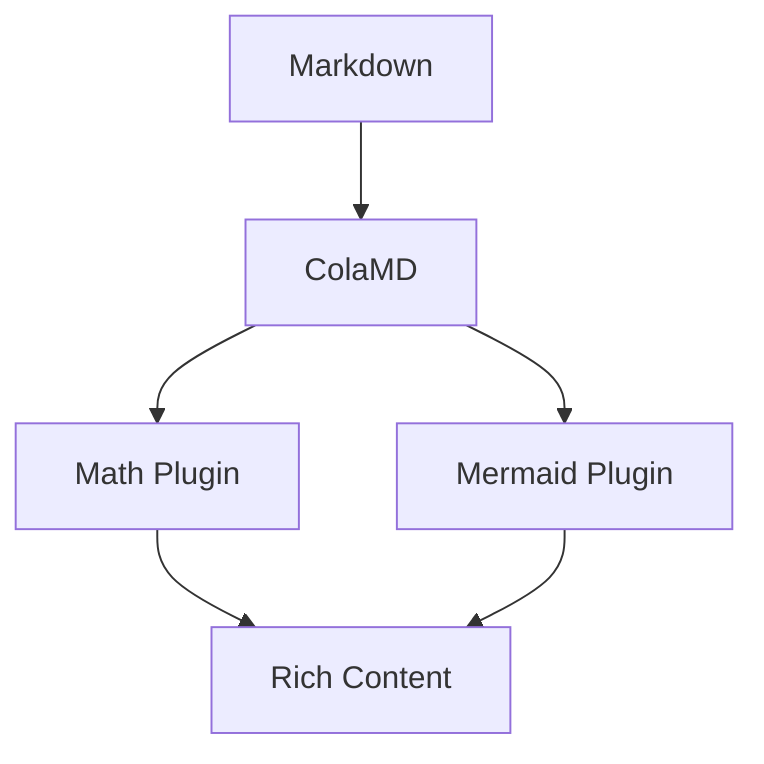

# ColaMD (Extended)

**Markdown as Database. The Agent Native Editor and Rich Content Rendering Platform.**

Extended from [marswaveai/ColaMD](https://github.com/marswaveai/colamd) v1.5.0 with a new **Renderer Plugin System** that supports WYSIWYG editing and rendering of math equations, Mermaid diagrams, and more. Markdown is no longer just plain text — it becomes a true content database.

Real-time collaboration between humans and AI agents — see your agent's changes as they happen. Turn any Markdown file into a slide deck, blog post, resume, or product page.

[](https://opensource.org/licenses/MIT)
[](https://github.com/marswaveai/colamd/releases)

**This Extended Edition**: [git@github.com:byteuser1977/ColaMD-extend.git](https://github.com/byteuser1977/ColaMD-extend)

[Features](#features) | [Renderer Plugins](#renderer-plugin-system) | [Plug Menu](#plug-menu--plugin-render-control) | [Quick Start](#quick-start) | [Mobile Build](#mobile-build--capacitor-6) | [Themes](#theme-system) | [Architecture](#technical-architecture) | [中文](README_CN.md)

---

## Why ColaMD?

AI agents are rewriting how we work. They edit files, generate docs, and produce reports — all in Markdown.

But how do you **watch** an agent work? You close the file. You reopen it. You wait.

**ColaMD changes this.** Open a `.md` file in ColaMD, let your agent edit it, and watch the content update in real time — like pair programming with an AI. No refresh, no reload, no friction.

This is what **Agent Native** means: built from the ground up for a world where humans and agents collaborate on the same files.

---

## What's Different from the Original

This repository extends **[marswaveai/ColaMD](https://github.com/marswaveai/colamd)** v1.5.0 with the following key differences:

| Aspect | Original ColaMD | This Extended Edition |
|--------|-----------------|----------------------|
| Content rendering | Plain Markdown text (GFM + Commonmark) only | **Markdown + Math Equations + Mermaid Diagrams** |
| Plugin system | None | **Declarative plugin architecture, independently toggleable, dynamically registered** |
| Math support | ❌ | ✅ KaTeX inline/block equations, live editing, PNG export |
| Diagram support | ❌ | ✅ Mermaid full-type diagrams (17+ types), multi-theme adaptation, PNG export |
| Dual-mode toggle | N/A | ✅ Each plugin supports **Rendered / Source Edit mode** one-click toggle |
| Mobile platform | ❌ Desktop only | ✅ **Android (.apk) + iOS (.ipa)** via Capacitor 6 |

> All original features are fully preserved: Agent real-time sync, activity indicator, WYSIWYG editor, slide system, themes & export, etc.

### Demo Documents

This project includes comprehensive demo documents to showcase the plugin capabilities:

#### General Demo — [`demo.md`](docs/demo.md)

A comprehensive demo covering:

- **Math Equations**: 7 inline equations + 6 block equations (including systems of equations, matrices, physics formulas)
- **Mermaid Diagrams**: All 17 diagram types (flowchart, sequence, class, state, ER, Gantt, pie, journey, git graph, mindmap, timeline, quadrant, XY chart, C4 context, Sankey, block, complex clustered)
- **Mixed Content**: Formulas and diagrams rendered together in the same document

Open `docs/demo.md` to fully test the plugin rendering, mode switching, source editing, and PNG export capabilities of the extended ColaMD.

#### Academic Paper Demo — [`academic-demo.md`](docs/academic-demo.md) 🆕

A real-world academic paper demonstrating the enhanced **Academic Paper theme** (`academic-paper.css`):

- **Full Academic Structure**: Abstract, keywords, CLC number, document identifier, introduction, methodology, tables, and references
- **GB/T 7713 Compliance**: Follows Chinese academic paper formatting standards with proper typography (SimHei headings + SimSun body text)
- **Three-Line Tables**: Academic-standard table format (top line + header bottom line + bottom line, no vertical borders)
- **Mermaid Diagrams**: Complex organizational charts with custom color schemes optimized for print
- **Mixed Content**: Mathematical formulas, Mermaid diagrams, tables, and citations in a single document

Open `docs/academic-demo.md` in ColaMD with the **Academic Paper** theme active to see the full effect. This demo showcases:
- Professional academic typography (黑体 for headings, 宋体 for body text)
- Print-optimized Mermaid diagram rendering
- Proper code block and blockquote styling for academic contexts
- Footnotes and reference section formatting

---

## Features

### 🔗 Agent Native (Inherited from Original)

- **Live Agent Sync** — When an AI agent (Claude Code, Cursor, Copilot, etc.) modifies your `.md` file, ColaMD detects changes via `fs.watch` and refreshes instantly. No manual reload needed. This is the core feature.
- **Agent Activity Indicator** — A breathing dot in the titlebar tells you the agent's status: orange pulse while writing, green flash when done.
- **Cmd+Click Links** — Click any link in the editor to open it directly in your browser.

### ✏️ Editor Core (Inherited from Original)

- **True WYSIWYG** — Type Markdown, see rich text rendered instantly. No split-pane preview needed.
- **Smart Line Breaks** — Single newlines render as `<br>`, matching how AI agents write Markdown.
- **Rich Text Copy** — Copy content and paste into WeChat, email, or any rich text editor with formatting fully preserved.
- **Minimal by Design** — No toolbar, no sidebar, no distractions. Just you and your content.

### 📊 Slides — Markdown as Database (Inherited from Original)

HTML is hard to edit. Markdown is easy.

ColaMD introduces a new idea: **Markdown as Database**. Your `.md` file is the content layer. HTML templates are the view layer. Change content by editing Markdown — never touch HTML.

One Markdown file, many possible renderings: slides, blog, resume, product page... Future templates can consume the same file in completely different ways.

#### How to Use

- **File → New Slides (`⌘⇧N`)** — Creates a `slides.md` tutorial template and opens it in the editor
- **File → Open as Slides (`⌘⇧P`)** — Spins up a local server and opens your current `.md` file as a slide deck in the browser
- **File → Export Slides...** — Export a shareable version (single-file HTML or folder with video resources)

#### Slide Format

```markdown
---
kicker: YOUR BRAND
chip: Event Name · 2026
page: YOUR NAME
---

<!-- type: cover -->
# Title
Subtitle here

---

<!-- type: statement -->
## Key Message
One powerful sentence.
```

Supported layouts: `cover` · `statement` · `section` · `video` · `thankyou`

Optional: background image (`bg: cover.png`), video embed (`src: demo.mp4`), inline image preview (`preview: screenshot.png`).

No image? The cover falls back to a clean orange-on-white design — it just works.

### 📤 Export Capabilities

- **PDF / HTML export**
- **Slide export** — Single HTML file (images Base64-inlined) or folder format (with video resources)
- **Equation / Diagram PNG export** — Right-click to export as high-definition PNG images (2x scaling)

### 🎨 Themes & Cross-Platform (Inherited from Original)

- **4 built-in themes** + [downloadable themes](themes/) + custom CSS import
- **Cross-platform** — macOS (.dmg), Windows (.exe), Linux (.AppImage / .deb)

---

## Renderer Plugin System

> ⭐ This is the core incremental feature of this extended edition. Plugins use a declarative registration architecture — each plugin is independently encapsulated and can be individually enabled or disabled.

### Architecture Overview

```
src/renderer/editor/plugins/
├── index.ts                    # Plugin manager (register/query/toggle)
├── math-plugin.ts              # 📐 Math equation renderer plugin
├── mermaid-plugin.ts           # 🔀 Mermaid diagram renderer plugin
├── mermaid-plugin.css          # Mermaid base styles
├── mermaid-plugin-dark.css     # Mermaid dark theme
├── mermaid-plugin-elegant.css  # Mermaid elegant theme
└── mermaid-plugin-newsprint.css # Mermaid newsprint theme
```

Every plugin follows a unified design pattern:

```
Schema Definition → NodeView Interaction → Remark Parsing → Markdown Serialization → PNG Export → Rendered/Source Dual Mode
```

---

### 📐 Math Plugin — Equation Rendering

**Source**: [math-plugin.ts](src/renderer/editor/plugins/math-plugin.ts) | **Dependencies**: [KaTeX](https://katex.org/) + remark-math

| Property | Description |
|-----------|-------------|
| Plugin ID | `math` |
| Default Enabled | ✅ Yes |
| Context Menu | Save Equation as PNG |
| Associated Nodes | `math_inline`, `math_block` |

#### Supported Syntax

```markdown
Inline equation: mass-energy equivalence $E = mc^2$ embedded within a paragraph.

Block equation (centered display):
$$
\int_{-\infty}^{\infty} e^{-x^2} dx = \sqrt{\pi}
$$
```

#### Feature Details

- **Inline equations (`$...$`)** — Uses `<span class="math-inline">` container, KaTeX rendered (`displayMode: false`), supports rendered / raw dual-mode toggle
- **Block equations (`$$...$$`)** — Uses `<div class="math-block">` container, KaTeX rendered (`displayMode: true`, centered display), raw mode uses `<textarea>` with auto-adjusting row count
- **Live editing** — Edit LaTeX source code directly in raw mode; auto-save and re-render on blur
- **Graceful fallback** — KaTeX rendering failures degrade elegantly to plain text display without blocking the editing workflow
- **PNG export** — Canvas + SVG foreignObject technology, 2x scaled high-definition output, white background, 16px padding

---

### 🔀 Mermaid Plugin — Diagram Rendering

**Source**: [mermaid-plugin.ts](src/renderer/editor/plugins/mermaid-plugin.ts) | **Dependencies**: [Mermaid.js](https://mermaid.js.org/)

| Property | Description |
|-----------|-------------|
| Plugin ID | `mermaid` |
| Default Enabled | ✅ Yes |
| Context Menu | Save Diagram as PNG |
| Associated Nodes | `mermaid_block` |

#### Supported Diagram Types (17+)

```markdown

```

| Category | Supported Diagrams |
|----------|-------------------|
| Flowchart | `graph` (TD/LR/RL/BT), `flowchart` |
| Sequence Diagram | `sequenceDiagram` |
| Class Diagram | `classDiagram` |
| State Diagram | `stateDiagram-v2` |
| ER Diagram | `erDiagram` |
| User Journey | `journey` |
| Pie Chart | `pie` |
| Gantt Chart | `gantt` |
| Git Graph | `gitGraph` |
| Mind Map | `mindmap` |
| Timeline | `timeline` |
| Quadrant Chart | `quadrantChart` |
| XY/Line/Bar Chart | `xyChart` |
| C4 Architecture | `C4Context`, `C4Container`, `C4Component`, `C4Dynamic`, `C4Deployment` |
| Sankey Diagram | `sankey-beta` |
| Block Diagram | `block-beta` |
| Architecture Diagram | `architecture-beta` |

#### Feature Details

- **Input shortcut rule** — Typing `\`\`\`mermaid` followed by Enter auto-converts to a mermaid_block node, no manual action needed
- **Dual-mode toggle** — One-click switch between rendered preview and source editing; raw mode uses `<textarea>` for direct Mermaid code editing
- **Async-safe rendering** — Render counter prevents race conditions, ensuring displayed results always match the latest code
- **Multi-theme deep adaptation** — Each built-in theme has a corresponding Mermaid color scheme (see theme adaptation table below)
- **C4 architecture-specific colors** — Independent semantic color configurations for persons/systems/containers/components
- **Auto node height adjustment** — Container height auto-adjusts after rendering (+6px padding) to prevent content overflow
- **PNG export** — SVG normalization → Image → Canvas → PNG, 2x high-definition output, white background

#### Mermaid Theme Adaptation

| UI Theme | Mermaid Theme Style | Font | Highlights |
|----------|---------------------|------|------------|
| **Light** | Default | System default | Clean & bright |
| **Dark** | GitHub Dark | System default | `#0d1117` background, `#8b949e` border/text |
| **Elegant** | Custom warm palette | LXGW WenKai | `#e8e2db` background, warm brown cScale |
| **Newsprint** | Print style | PT Serif | Serif font, newsprint texture |
| **Forest Ink** (custom) | Forest green palette | Noto Serif SC | `#f5f1e8` paper base, `#3d6b4a` forest green accent, ink-green lines |

---

## How It Works

```
┌─────────────┐     writes     ┌──────────────┐
│  AI Agent   │ ──────────────▶│  .md file    │
│ (Claude,    │                │              │
│  Cursor...) │                └──────┬───────┘
└─────────────┘                       │
                              fs.watch detects change
                                      │
                              ┌───────▼───────┐
                              │    ColaMD     │
                              │  auto-refresh │
                              │   ✨ live!    │
                              │               │
                              │  ┌───────────┐ │
                              │  │ Plugin     │ │
                              │  │ ├─ Math    │ │
                              │  │ └─ Mermaid │ │
                              │  └───────────┘ │
                              └───────────────┘
```

1. Open any `.md` file in ColaMD
2. Let your AI agent edit that file
3. Watch the content update in real time — including instant rendering of math equations and Mermaid diagrams
4. The indicator dot pulses orange while the agent writes

No configuration needed. It just works out of the box.

---

## Plug Menu — Plugin Render Control

ColaMD provides a **Plug** menu in the top menu bar to control renderer plugin behavior. Each registered plugin (e.g., Math, Mermaid) can be independently managed through this menu.

### Menu Structure

```
Plug
├── Math
│   ├── Rendered      # Rendered mode: display rich text effects of equations/diagrams
│   └── Raw           # Source mode: display raw Markdown code, editable directly
└── Mermaid
    ├── Rendered      # Rendered mode: display SVG visualization of diagrams
    └── Raw           # Source mode: display Mermaid code, editable directly
```

### Rendered Mode

- Plugin content is presented as rich text
- **Math**: Beautiful math equations rendered by KaTeX, inline equations embedded in paragraphs, block equations centered
- **Mermaid**: SVG vector diagrams, supporting visualization of 17+ diagram types
- Right-click to export as PNG images

### Source Mode (Raw)

- Plugin content is presented as raw Markdown source
- Uses `<textarea>` to display and edit code directly
- **Live editing**: Edit LaTeX equations or Mermaid diagram code directly in the text box
- **Auto-save**: Modifications are automatically saved on blur, instantly switching back to rendered mode to display updated results
- Text box height auto-adjusts based on content line count to avoid scrollbars

### Usage Example

1. Enter a Mermaid code block:
   ````markdown
   ```mermaid
   graph TD
       A[Start] --> B[Process]
       B --> C[End]
   ```
   ````
2. Click **Plug → Mermaid → Rendered** to view the diagram
3. Click **Plug → Mermaid → Raw** to switch to source mode, edit nodes and connections directly
4. Click elsewhere in the editor to blur, auto-save and re-render

### Design Intent

- **WYSIWYG and source free switching**: Meet different scenario needs — view rendered effects when reading, edit source code when writing
- **Zero-friction editing**: No need to memorize special shortcuts, one-click menu toggle, auto-save on blur
- **Fully decoupled plugins**: Each plugin is independently controlled without mutual interference; newly added plugins automatically appear in the menu

---

## Quick Start

### Prerequisites

- **Node.js** >= 18
- **npm** >= 9

### Install & Run

```bash
# Clone this extended edition repository
git clone https://github.com/byteuser1977/ColaMD-extend.git
cd ColaMD-extend

# Install dependencies
npm install

# Start in development mode
npm run dev
```

### Build & Package

```bash
# Build
npm run build

# Package for current platform
npm run dist

# Package for specific platform
npm run dist:mac      # macOS (.dmg)
npm run dist:win      # Windows (.exe)
npm run dist:linux    # Linux (.AppImage / .deb)
```

### Download Pre-built Binaries

> Check this extended edition's [GitHub Releases](https://github.com/byteuser1977/ColaMD-extend/releases) for the latest builds. Original releases are available at [marswaveai/colamd](https://github.com/marswaveai/colamd/releases).

| Platform | Format |
|----------|--------|
| macOS | `.dmg` |
| Windows | `.exe` |
| Linux | `.AppImage` / `.deb` |
| Android | `.apk` (via Capacitor) |
| iOS | `.ipa` (via Capacitor, requires Xcode) |

---

## Mobile Build — Capacitor 6

> Starting from v1.5.1, ColaMD supports building native mobile apps via **[Capacitor 6](https://capacitorjs.com/)** — the cross-platform runtime by Ionic. The same codebase that powers the Electron desktop app now runs on Android and iOS devices.

### Architecture: Dual-Platform Bridge

ColaMD uses an **auto-detection bridge layer** that seamlessly switches between Electron (desktop) and Capacitor (mobile) APIs at runtime:

```
┌─────────────────────────────────────┐
│         src/renderer/main.ts         │
│   api = electronAPI || capacitorAPI  │ ← Auto-detect platform
├──────────────┬──────────────────────┤
│  Electron    │     Capacitor 6      │
│  (Desktop)   │     (Mobile)          │
│              │                      │
│ IPC comm     │ Filesystem Plugin    │
│ dialog       │ Share Plugin         │
│ shell.open   │ App Plugin           │
│ fs module    │ localStorage storage │
└──────────────┴──────────────────────┘
```

**Key files**:
- [`capacitor-api.ts`](src/renderer/capacitor-api.ts) — Full Capacitor bridge implementing the same API surface as `electronAPI`
- [`capacitor.config.ts`](capacitor.config.ts) — Capacitor configuration (appId, webDir, plugins)
- [`mobile.css`](src/renderer/mobile.css) — Touch-optimized responsive styles
- [`MainActivity.java`](android/app/src/main/java/cn/bytechain/colamd/MainActivity.java) — Android WebView IME support

### Technology Stack for Mobile

| Component | Technology | Purpose |
|-----------|------------|---------|
| **Runtime** | Capacitor 6.x | Cross-platform native bridge |
| **WebView Engine** | Android WebView / iOS WKWebView | Renders web content |
| **File Access** | `@capacitor/filesystem` | Read/write local files |
| **File Picker** | `@capawesome/capacitor-file-picker` | Native file selection dialog |
| **Sharing** | `@capacitor/share` | System share sheet integration |
| **App Lifecycle** | `@capacitor/app` | Handle app events (pause, resume) |
| **Status Bar** | `@capacitor/status-bar` | Status bar styling |
| **Haptics** | `@capacitor/haptics` | Haptic feedback |

### Prerequisites for Mobile Build

| Platform | Requirements |
|----------|-------------|
| **Android** | Android Studio + SDK (API 34+) + **Java 21** (`brew install openjdk@21`) |
| **iOS** | Xcode 15+ + CocoaPods + macOS |

### Quick Start — Android

```bash
# 1. Install dependencies (Capacitor packages included)
npm install

# 2. Build web assets
npm run build

# 3. Sync to Android platform
npx cap sync android

# 4. Open in Android Studio
npx cap open android

# 5. Or build APK directly
npm run cap:build:android
# Output: android/app/build/outputs/apk/debug/app-debug.apk
```

### Quick Start — iOS

```bash
# 1. Sync to iOS platform
npx cap sync ios

# 2. Open in Xcode
npx cap open ios

# 3. Build in Xcode (⌘R) or use:
npm run cap:build:ios
```

### Build Commands

| Command | Description | Output |
|---------|-------------|--------|
| `npm run cap:sync` | Sync web assets to all platforms | Updated `android/` and `ios/` |
| `npm run cap:open:android` | Open Android project in Android Studio | — |
| `npm run cap:open:ios` | Open iOS project in Xcode | — |
| `npm run cap:run:android` | Build → Sync → Run on device/emulator | Live app on device |
| `npm run cap:run:ios` | Build → Sync → Run on simulator | Live app in simulator |
| `npm run cap:build:android` | Build **Debug APK** | `android/app/build/outputs/apk/debug/app-debug.apk` |
| `npm run cap:build:android:release` | Build **Release APK** (signed) | `android/app/build/outputs/apk/release/app-release.apk` |
| `npm run cap:build:ios` | Prepare iOS project for Xcode build | — |

### Release Build — Android

For production release builds, the project includes a signing configuration:

```bash
# Build signed release APK
npm run cap:build:android:release

# Output location
android/app/build/outputs/apk/release/app-release.apk
```

The release keystore is located at `android/app/release.keystore` with credentials stored in `build.gradle`.

### Release Build — iOS

1. Open the project in Xcode:
   ```bash
   npx cap open ios
   ```

2. In Xcode:
   - Select **Product → Archive**
   - Once archived, click **Distribute App**
   - Choose distribution method (App Store Connect, Ad Hoc, etc.)

3. For App Store submission:
   - Configure signing certificates in Xcode
   - Upload to App Store Connect via Xcode or Transporter

### Chinese IME Support (Android)

ColaMD includes special handling for Chinese/Japanese/Korean input methods on Android WebView:

**Implementation** ([`MainActivity.java`](android/app/src/main/java/cn/bytechain/colamd/MainActivity.java)):
- WebView focus optimization for IME connection
- Soft keyboard auto-show on focus
- Touch mode focusability enabled

**Known Limitations**:
- ProseMirror/Milkdown has known IME composition issues on Android WebView
- Some input methods may require tapping the editor area to activate
- If input seems stuck, try tapping elsewhere then back to the editor

### File Picker Integration

Mobile platforms use `@capawesome/capacitor-file-picker` for native file selection:

```typescript
// Example usage (internal)
const result = await FilePicker.pickFiles({
  types: ['text/markdown', 'text/plain'],
  multiple: false,
  readData: true,
})
```

**Supported file types**: `.md`, `.markdown`, `.txt`, `.css` (for themes)

### Mobile Features & Limitations

| Feature | Status | Notes |
|---------|--------|-------|
| Markdown editing ✏️ | ✅ Fully supported | Milkdown editor runs in WebView |
| Math rendering (KaTeX) 📐 | ✅ Fully supported | Same as desktop |
| Mermaid diagrams 🔀 | ✅ Fully supported | SVG renders in WebView |
| Plugin system | ✅ Fully supported | Toggle via UI, state in localStorage |
| Themes | ✅ Fully supported | All themes work on mobile |
| File open/save | ✅ Supported | Native file picker via FilePicker plugin |
| Chinese/Japanese/Korean input | ⚠️ Partial | IME support implemented, may have edge cases |
| Export HTML/PDF | ⚠️ Partial | HTML export works; PDF uses `window.print()` |
| Agent file watch | ⚠️ Polling mode | Uses 2s interval instead of `fs.watch` |
| Slides preview | ⚠️ Limited | Opens new browser window on desktop; basic on mobile |
| External links | ✅ Supported | Opens in system browser via `_system` target |

### Responsive Design

The mobile CSS ([`mobile.css`](src/renderer/mobile.css)) provides:

- **Touch optimization**: Disabled tap highlight, proper touch-action
- **Safe area support**: Automatic padding for notched devices (iPhone X+, modern Android)
- **Responsive breakpoints**: 
  - ≤768px: Tablet layout adjustments
  - ≤480px: Phone layout with smaller fonts
- **Editor adaptation**: Fixed-position editor filling viewport below header
- **Scroll behavior**: `-webkit-overflow-scrolling: touch` for smooth scrolling
- **Context menu**: Touch-friendly with larger tap targets (12px padding, 15px font)

### Troubleshooting Mobile Issues

**Chinese input not working**:
- Tap the editor area to ensure focus
- Try switching to another app and back
- Check that the soft keyboard is visible

**File picker not opening**:
- Ensure storage permissions are granted
- On Android 11+, check "Allow all the time" for storage permission

**App crashes on launch**:
- Run `npx cap sync android` to ensure latest web assets
- Check Android Studio logcat for errors
- Ensure Java 21 is correctly configured

**Build fails**:
```bash
# Clean and rebuild
cd android
./gradlew clean
cd ..
npm run cap:build:android
```

---

## Theme System

ColaMD includes **4 built-in themes**, and all renderer plugins automatically adapt to the active theme:

| Theme | Identifier | Style Description |
|-------|-----------|-------------------|
| **Light** | `theme-light` | Light theme, clean & bright |
| **Dark** | `theme-dark` | Dark theme, GitHub Dark style |
| **Elegant** | `theme-elegant` | Elegant theme, warm serif style (**default theme**) |
| **Newsprint** | `theme-newsprint` | Newsprint style |

Downloadable external themes (located in [`themes/`](themes/) directory):

| Theme File | Style Description |
|------------|-------------------|
| [elegant.css](themes/elegant.css) | Warm serif with terracotta accents, LXGW WenKai font |
| [guizang.css](themes/guizang.css) | Ancient Guizang style, ochre accents, ink-black code blocks |
| [forest-ink.css](themes/forest-ink.css) | 🌲 Forest Ink, warm paper base + forest green ink text + forest green accent |
| [academic-paper.css](themes/academic-paper.css) | 📄 **Academic Paper (Enhanced)** — GB/T 7713 compliant, SimHei headings + SimSun body text, three-line tables, print-optimized Mermaid diagrams, footnotes & references styling. See [`academic-demo.md`](docs/academic-demo.md) for a complete example |
| [pixso-design.css](themes/pixso-design.css) | 🎨 Pixso Design, modern design system style |
| [swiss-design.css](themes/swiss-design.css) | 🇨🇭 **Swiss Design (International Typographic Style)** — Pure black-white-red color system, geometric sans-serif fonts (Helvetica/Inter), grid-based layout with generous whitespace, form follows function. Minimalist and restrained aesthetic inspired by Swiss International Typographic Style |

Custom theme support: Place CSS files in `~/.colamd/themes/` directory, then import via **Theme > Import Theme**. Imported themes persist across sessions.

---

## Technical Architecture

```
┌─────────────────────────────────────────────────────────────┐
│                    ColaMD — Dual Platform                     │
│                                                              │
│  ┌──────────────────────┐   ┌────────────────────────────┐  │
│  │    Desktop (Electron) │   │     Mobile (Capacitor 6)    │  │
│  │                       │   │                            │  │
│  │  ┌─────────┐ ┌──────┐ │   │  ┌──────────────────────┐  │  │
│  │  │ Main    │ │Preload│ │   │  │  Capacitor Runtime   │  │  │
│  │  │Process  │ │Bridge │ │   │  │  (WebView / WKWebView)│  │  │
│  │  └────┬────┘ └──┬───┘ │   │  └──────────┬───────────┘  │  │
│  │       │   IPC   │     │   │             │ Plugins       │  │
│  │       └────┬────┘     │   │             ├─ Filesystem    │  │
│  │            ▼          │   │             ├─ Share         │  │
│  │  ┌─────────────────┐  │   │             ├─ App           │  │
│  │  │   Renderer      │  │   │             ├─ StatusBar     │  │
│  │  │   Process       │◄─┼───┼─────────────┤               │  │
│  │  └────────┬────────┘  │   │            └─ Haptics       │  │
│  │           ▼           │   └──────────────┬───────────────┘  │
│  │  ┌──────────────────┐ │                  │                  │
│  │  │  Milkdown Editor │◄┘                  │                  │
│  │  │  (ProseMirror)   │                    │                  │
│  │  │  ┌────────────┐  │                    │                  │
│  │  │  │Plugin Syst.│  │                    │                  │
│  │  │  │├─ 📐 Math  │  │                    │                  │
│  │  │  │└─ 🔀Mermaid│  │                    │                  │
│  │  │  └────────────┘  │                    │                  │
│  │  └──────────────────┘                    │                  │
│  └──────────────────────┘                    │                  │
│                   ┌──────────────────────────┘                  │
│                   ▼                                             │
│          Auto-detection:                                         │
│          api = electronAPI || capacitorAPI                       │
└─────────────────────────────────────────────────────────────┘
```

### Tech Stack

| Technology | Purpose | Version | Documentation |
|------------|---------|---------|---------------|
| [Electron](https://www.electronjs.org/) | Cross-platform desktop framework | ^34.0.0 | [📖 Docs](https://www.electronjs.org/docs/latest/) |
| [Capacitor](https://capacitorjs.com/) | Cross-platform mobile runtime (Android/iOS) | ^6.2.1 | [📖 Docs](https://capacitorjs.com/docs/) |
| [Milkdown](https://milkdown.dev/) | WYSIWYG Markdown editor core (ProseMirror-based) | ^7.19.2 | [📖 Docs](https://milkdown.dev/docs) |
| [ProseMirror](https://prosemirror.net/) | Underlying rich text editing engine | — | [📖 Docs](https://prosemirror.net/docs/) |
| [KaTeX](https://katex.org/) | Math equation rendering engine | ^0.16.46 | [📖 Docs](https://katex.org/docs/) |
| [Mermaid.js](https://mermaid.js.org/) | Diagram rendering library | ^11.15.0 | [📖 Docs](https://mermaid.js.org/intro/) |
| [TypeScript](https://www.typescriptlang.org/) | Type-safe development language | ^5.7.0 | [📖 Docs](https://www.typescriptlang.org/docs/) |
| [electron-vite](https://electron-vite.org/) | Electron build toolchain | ^3.0.0 | [📖 Docs](https://electron-vite.org/guide/) |
| [Vite](https://vitejs.dev/) | Underlying build engine | ^6.0.0 | [📖 Docs](https://vitejs.dev/guide/) |

> 💡 **Dev Tip**: The official documentation of each library is the best reference for developing new plugins and custom features. In particular, the [KaTeX supported syntax](https://katex.org/docs/supported.html), [Mermaid diagram syntax](https://mermaid.js.org/intro/syntax-reference.html), and [Capacitor plugins API](https://capacitorjs.com/docs/apis) are essential for extending capabilities across platforms.

### Project Structure

```
src/
├── main/
│   └── index.ts              # Main process: window management, file I/O, menus, file watching
├── preload/
│   └── index.ts              # Secure IPC bridge layer (Electron)
└── renderer/
    ├── index.html            # Entry HTML
    ├── main.ts               # Renderer entry: auto-detects Electron or Capacitor
    ├── capacitor-api.ts      # ★ Capacitor bridge layer (replaces Electron APIs on mobile)
    ├── mobile.css            # ★ Touch-optimized responsive styles
    ├── editor/
    │   ├── editor.ts         # Editor orchestration core (plugin integration)
    │   └── plugins/          # ★ Renderer plugin system
    │   ├── html-view.ts      # HTML inline node view
    │   └── plugins/          # ★ Renderer plugin system
    │       ├── index.ts      # Plugin manager (register/query/toggle)
    │       ├── math-plugin.ts
    │       ├── mermaid-plugin.ts
    │       └── *.css         # Plugin styles (with multi-theme adaptation)
    └── themes/
        ├── base.css          # Base styles
        └── theme-manager.ts  # Theme switching manager
```

### Design Philosophy

The entire project has only **5 runtime dependencies** + **6 dev dependencies**, strictly following the principle of **"If not necessary, do not add entity"**:

- No toolbar (users use shortcuts and Markdown syntax)
- No sidebar or status bar
- No file management, cloud sync, or collaborative editing
- Pursue extreme simplicity — each plugin has a single clear responsibility, fully decoupled and independently toggleable

---

## Inline SVG Guide

> ⚠️ **Important**: ColaMD uses remark/rehype to parse Markdown, where **blank lines act as paragraph separators**. For inline SVG to render correctly, the entire HTML block (including `<div>`, `<svg>`, `<p>` tags) **must be on a single line without any line breaks**.

### Why Single-Line Format?

ColaMD's parsing pipeline:

```
Markdown Source
    ↓
remark-parse (Markdown → MDAST)
    ↓
remark plugins processing
    ↓
Blank line detection: encountering blank line → creates new paragraph node
    ↓
rehype (MDAST → HAST)
    ↓
ProseMirror serialization
    ↓ Each paragraph → independent htmlSchema.node
    ↓
html-view.ts injects into DOM
    ↓
Final output: <span class="milkdown-html-inline">single block</span>
```

**Multi-line format consequence**:

```html
<!-- If SVG is split across multiple lines (with blank lines) -->

Markdown:
<div>
<svg>
  <defs>...</defs>

  <rect/>

  <circle/>
</svg>
</div>

Exported HTML:
<p><span>...<svg><defs>...</defs></svg></span></p>  ← Block 1
<p><span>  <rect/></span></p>                        ← Block 2 (independent!)
<p><span>  <circle/></span></p>                      ← Block 3 (independent!)

Result: ❌ SVG fragmented, cannot render correctly
```

**Single-line format effect**:

```html
<!-- Entire content on one line (no blank lines) -->

Markdown:
<div><svg><defs>...</defs><rect/><circle/></svg><p>Caption</p></div>

Exported HTML:
<p><span>
  <div><svg>complete content</svg><p>Caption</p></div>
</span></p>

Result: ✅ Complete SVG renders correctly
```

### SVG Specification Requirements

| # | Rule | Importance | Description |
|---|------|------------|-------------|
| 1 | 🔴 **Single-line compression** | **Required** | Entire `<div>` block must not contain line breaks |
| 2 | ✅ **Tag closure** | Required | All tags must be properly closed or self-closing |
| 3 | ✅ **Namespace** | Required | Must include `xmlns="http://www.w3.org/2000/svg"` |
| 4 | **Size matching** | Required | `width`/`height` must match `viewBox` |
| 5 | **Double quotes** | Recommended | All attribute values should use double quotes |
| 6 | **ASCII characters** | Recommended | Avoid special symbols; use `-` instead of `→` |

### Example: Complex Inline SVG

```html
<div style="text-align: center; margin: 20px 0;"><svg width="600" height="400" viewBox="0 0 600 400" xmlns="http://www.w3.org/2000/svg" style="display: block; margin: 0 auto; background: #f5f5f5; border-radius: 12px;"><defs><linearGradient id="grad1" x1="0%" y1="0%" x2="100%" y2="100%"><stop offset="0%" style="stop-color:#4A90E2;stop-opacity:1"/><stop offset="100%" style="stop-color:#357ABD;stop-opacity:1"/></linearGradient><linearGradient id="grad2" x1="0%" y1="0%" x2="100%" y2="0%"><stop offset="0%" style="stop-color:#7ED321;stop-opacity:1"/><stop offset="100%" style="stop-color:#5DB80D;stop-opacity:1"/></linearGradient></defs><rect width="600" height="400" fill="#f5f5f5" rx="12"/><rect x="40" y="40" width="520" height="60" rx="8" fill="url(#grad1)"/><text x="300" y="78" fill="white" text-anchor="middle" font-size="22" font-weight="bold">Inline SVG Example</text><circle cx="150" cy="180" r="50" fill="url(#grad1)"/><text x="150" y="188" fill="white" text-anchor="middle" font-size="16" font-weight="bold">Node A</text><rect x="250" y="130" width="100" height="100" rx="10" fill="url(#grad2)"/><text x="300" y="185" fill="white" text-anchor="middle" font-size="16" font-weight="bold">Node B</text><polygon points="450,130 500,180 450,230 400,180" fill="#E74C3C"/><text x="450" y="188" fill="white" text-anchor="middle" font-size="14" font-weight="bold">Node C</text><line x1="200" y1="180" x2="250" y2="180" stroke="#666" stroke-width="2" stroke-dasharray="5,5"/><line x1="350" y1="180" x2="400" y2="180" stroke="#666" stroke-width="2" stroke-dasharray="5,5"/><rect x="100" y="280" width="400" height="80" rx="8" fill="white" stroke="#ddd" stroke-width="1"/><text x="300" y="310" fill="#333" text-anchor="middle" font-size="14" font-weight="bold">Three-Layer Rocket Model</text><text x="300" y="335" fill="#666" text-anchor="middle" font-size="12">Material - Manufacturing - Platform</text></svg><p style="font-size: 10pt; color: #666; margin-top: 12px;">Figure: Complex inline SVG example (single-line compressed format)</p></div>
```

### Comparison: Inline vs External SVG

| Feature | Inline SVG | External SVG |
|---------|-----------|--------------|
| **Use case** | Demo, learning, simple icons | Production environment, complex graphics |
| **Code location** | Inside Markdown file | Independent `.svg` file |
| **Format requirement** | 🔴 **Must be single-line compressed** | No special requirements |
| **Maintainability** | ⚠️ Difficult (long lines hard to read) | ✅ Excellent (independent files) |
| **Complexity limit** | Limited by single-line length | Unlimited |
| **Browser cache** | ❌ Cannot be cached | ✅ Auto-cached |

### Best Practices

#### When to Use Inline SVG:
- ✅ Demonstrations and learning purposes
- ✅ Simple icons (< 10 elements)
- ✅ Need single-file delivery
- ✅ Quick prototype development

#### When to Use External SVG:
- ✅ Production documents
- ✅ Complex graphics (> 20 elements)
- ✅ Need frequent editing and maintenance
- ✅ Team collaboration projects

### Maintenance Tips

1. **Use temporary line breaks during editing**
   ```html
   <!-- Development phase: readable format -->
   <svg ...>
     <rect .../>
     <circle .../>
   </svg>

   <!-- Before saving: compress to one line -->
   <svg ...><rect .../><circle .../></svg>
   ```

2. **Use editor's "Join Lines" feature**
   - VS Code: `Ctrl+J` (Windows) / `Cmd+J` (Mac)
   - WebStorm: `Ctrl+Shift+J`

3. **Version control friendly**
   - Git diff shows entire line changes
   - Consider using `.gitattributes` for long-line handling

---

## Acknowledgments & Copyright

### Original Project

This project is an extended development based on **[marswaveai/ColaMD](https://github.com/marswaveai/colamd)** v1.5.0.

**Original Author**: [marswave.ai](https://marswave.ai) (hello@marswave.ai)

The original ColaMD is an excellent Agent Native Markdown editor. Its design philosophy of "if not necessary, do not add entity" has profoundly influenced the development philosophy of this project. This extended edition preserves all original features while adding a renderer plugin system to support richer Markdown content expression.

### Third-Party Open Source Libraries

This project depends on the following excellent open source projects:

| Project | License | Purpose |
|---------|---------|---------|
| [Electron](https://github.com/electron/electron) | MIT | Cross-platform desktop framework |
| [Milkdown](https://github.com/Milkdown/milkdown) | MIT | WYSIWYG Markdown editor core |
| [ProseMirror](https://github.com/ProseMirror/prosemirror) | MIT | Underlying rich text editing engine |
| [KaTeX](https://github.com/KaTeX/KaTeX) | MIT | Math equation rendering |
| [Mermaid.js](https://github.com/mermaid-js/mermaid) | MIT | Diagram rendering |
| [Vite](https://github.com/vitejs/vite) | MIT | Build tool |
| [TypeScript](https://github.com/microsoft/TypeScript) | Apache-2.0 | Development language |

We thank the authors and maintainers of the above projects for their outstanding contributions to the open source community.

### Open Source License

Copyright (c) 2026 [marswave.ai](https://marswave.ai) (Original) | [byteuser1977](https://github.com/byteuser1977) (Extended Edition)

Released under the [MIT License](LICENSE) — free and open source forever.

> THE SOFTWARE IS PROVIDED "AS IS", WITHOUT WARRANTY OF ANY KIND, EXPRESS OR IMPLIED, INCLUDING BUT NOT LIMITED TO THE WARRANTIES OF MERCHANTABILITY, FITNESS FOR A PARTICULAR PURPOSE AND NONINFRINGEMENT. IN NO EVENT SHALL THE AUTHORS OR COPYRIGHT HOLDERS BE LIABLE FOR ANY CLAIM, DAMAGES OR OTHER LIABILITY, WHETHER IN AN ACTION OF CONTRACT, TORT OR OTHERWISE, ARISING FROM, OUT OF OR IN CONNECTION WITH THE SOFTWARE OR THE USE OR OTHER DEALINGS IN THE SOFTWARE.

---

## Community & Support

### Related Links

| Link | Description |
|------|-------------|
| [GitHub Repository (Extended)](https://github.com/byteuser1977/ColaMD-extend) | This extended edition |
| [GitHub Repository (Original)](https://github.com/marswaveai/colamd) | Original project address |
| [GitHub Releases (Extended)](https://github.com/byteuser1977/ColaMD-extend/releases) | Download latest extended version |
| [GitHub Releases (Original)](https://github.com/marswaveai/colamd/releases) | Download original version |
| [Issues (Extended)](https://github.com/byteuser1977/ColaMD-extend/issues) | Bug reports & suggestions for this edition |
| [Issues (Original)](https://github.com/marswaveai/colamd/issues) | Bug reports for original project |
| [marswave.ai](https://marswave.ai) | Official website |

### Contributing

You are welcome to participate in the following ways:

- **Submit Issues** — Please report bugs or share new feature ideas via GitHub Issues
- **Pull Request** — Code improvements are welcome, especially new renderer plugins
- **Theme Contributions** — Create beautiful CSS themes and share them with the community

### Roadmap

ColaMD will evolve alongside the agent ecosystem:

- ~~v1.1~~ — ✅ Live file reload, file associations, drag & drop, theme system
- ~~v1.2~~ — ✅ New icon
- ~~v1.3~~ — ✅ Agent activity indicator, Cmd+click links, rich text copy, smart line breaks, PDF/HTML export, theme persistence
- ~~v1.4~~ — ✅ Slides: Markdown as Database, HTML template rendering
- ~~v1.5~~ — ✅ Export Slides: single-file HTML with inlined images
- **Current Version** — 🆕 Renderer Plugin System: Math equation rendering + Mermaid diagram rendering
- **Future Plans** — More renderer plugins (syntax highlighting, enhanced flowcharts, etc.), bidirectional sync, multi-file watching

---

*Extended from [marswaveai/ColaMD](https://github.com/marswaveai/colamd), built for the agent-native future.*
