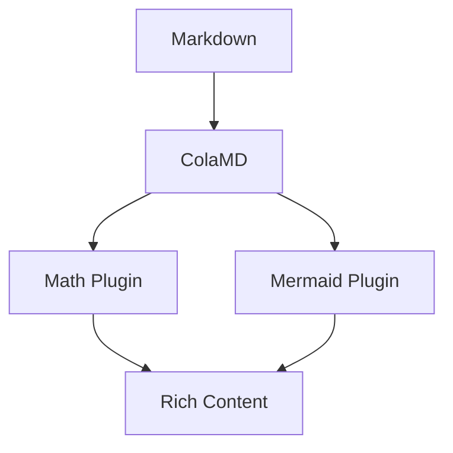

# ColaMD（扩展版）

**Markdown as Database。Agent Native 的编辑器与富内容渲染平台。**

基于 [marswaveai/ColaMD](https://github.com/marswaveai/colamd) 扩展，新增**显示插件系统**，支持数学公式、Mermaid 图表等丰富内容的所见即所得编辑与渲染。让 Markdown 不再只是纯文本，而成为真正的内容数据库。

人类与 AI Agent 的实时协作 — Agent 的每一次修改，你都能即时看到。把任意 Markdown 文件渲染成幻灯片、博客、简历或产品页。

[](https://opensource.org/licenses/MIT)
[](https://github.com/marswaveai/colamd/releases)

**本扩展版仓库**: [git@github.com:byteuser1977/ColaMD-extend.git](https://github.com/byteuser1977/ColaMD-extend)

[功能特性](#功能特性) | [显示插件](#显示插件系统) | [Plug 菜单](#plug-菜单--插件渲染控制) | [快速开始](#快速开始) | [主题系统](#主题系统) | [技术架构](#技术架构) | [English](README.md)

***

## &#x20;ColaMD 是什么？

AI Agent 正在改变我们的工作方式。它们编辑文件、生成文档、产出报告 — 全是 Markdown。

但你怎么**看到** Agent 的工作？关掉文件？再打开？等着？

**ColaMD 改变了这一切。** 用 ColaMD 打开 `.md` 文件，让 Agent 去编辑它，内容会实时更新 — 就像和 AI 结对编程。不需要刷新，不需要重新加载，零摩擦。

这就是 **Agent Native** 的含义：从底层为人类和 Agent 协作而生。

***

## 与原版的区别

本仓库基于 **[marswaveai/ColaMD](https://github.com/marswaveai/colamd)** v1.5.0 进行扩展，核心差异在于：

| 维度    | 原版 ColaMD                       | 本扩展版                                |
| ----- | ------------------------------- | ----------------------------------- |
| 内容渲染  | 纯 Markdown 文本（GFM + Commonmark） | **Markdown + 数学公式 + Mermaid 图表**    |
| 插件系统  | 无                               | **声明式插件架构，可独立启停、动态注册**              |
| 公式支持  | ❌                               | ✅ KaTeX 行内/块级公式，实时编辑，PNG 导出         |
| 图表支持  | ❌                               | ✅ Mermaid 全类型图表（17+ 种），多主题适配，PNG 导出 |
| 双模式切换 | N/A                             | ✅ 每个插件均支持 **渲染模式 / 源码编辑模式** 一键切换    |

> 原版所有功能完整保留：Agent 实时同步、活动指示器、所见即所得编辑器、幻灯片系统、主题与导出等。

### 演示文档

本项目包含一份完整的演示文档 [`demo.md`](demo.md)，涵盖：

- **Math 公式**：7 个行内公式 + 6 个块级公式（含方程组、矩阵、物理公式等）
- **Mermaid 图表**：17 种图表类型全部覆盖（流程图、时序图、类图、状态图、ER 图、甘特图、饼图、用户旅程图、Git 图、思维导图、时间线、四象限图、XY 图表、C4 架构图、Sankey 图、Block 图、复杂聚群图）
- **混合内容**：公式与图表在同一文档中协同渲染

打开 `demo.md` 即可全面测试 ColaMD 扩展版的插件渲染、模式切换、源码编辑和 PNG 导出功能。

***

## 功能特性

### 🔗 Agent Native（继承自原版）

- **实时 Agent 同步** — 当 AI Agent（Claude Code、Cursor、Copilot 等）修改 `.md` 文件时，ColaMD 通过 `fs.watch` 检测变更并即时刷新，无需手动重载。这是核心功能。
- **Agent 活动指示器** — 标题栏的呼吸灯告诉你 Agent 的状态：橙色脉冲表示正在写入，绿色闪现表示写入完成。
- **Cmd+点击链接** — 点击编辑器中的链接直接在浏览器打开。

### ✏️ 编辑器核心（继承自原版）

- **真正的所见即所得** — 输入 Markdown，直接看到富文本效果，无需分屏预览。
- **智能换行** — 单个换行符直接渲染为 `<br>`，匹配 AI Agent 写 Markdown 的习惯。
- **富文本复制** — 复制内容后可直接粘贴到微信、邮件等富文本编辑器中，格式完整保留。
- **极简设计** — 没有工具栏，没有侧边栏，没有干扰。只有你和你的内容。

### 📊 幻灯片系统 — Markdown as Database（继承自原版）

HTML 难改。Markdown 好改。

ColaMD 提出一个新理念：**Markdown as Database**。`.md` 文件是内容层，HTML 模板是视图层。改内容只改 Markdown，完全不碰 HTML。

一份 Markdown，多种渲染形态：幻灯片、博客、简历、产品页……未来各种模板都可以消费同一份文件。

#### 使用方式

- **File → New Slides（⌘⇧N）** — 创建 `slides.md` 教程模板，在编辑器里直接编辑内容
- **File → Open as Slides（⌘⇧P）** — 启动本地服务，在浏览器打开当前 `.md` 文件的幻灯片
- **File → Export Slides...** — 导出可分享版本（单文件 HTML 或含视频的文件夹）

#### Slide 格式

```markdown
---
kicker: YOUR BRAND
chip: 活动名称 · 2026
page: YOUR NAME
---

<!-- type: cover -->
# 标题
副标题

---

<!-- type: statement -->
## 核心观点
一句有力量的话。
```

支持版式：`cover` · `statement` · `section` · `video` · `thankyou`

可选：背景图（`bg: cover.png`）、视频嵌入（`src: demo.mp4`）、图片预览（`preview: screenshot.png`）。

### 📤 导出能力

- **PDF / HTML 导出**
- **幻灯片导出** — 单文件 HTML（图片 Base64 内联）或文件夹形式（含视频资源）
- **公式 / 图表 PNG 导出** — 右键菜单一键导出为高清 PNG 图片（2x 缩放）

### 🎨 主题与跨平台（继承自原版）

- **4 个内置主题** + [可下载主题](themes/) + 自定义 CSS 导入
- **跨平台** — macOS（.dmg）、Windows（.exe）、Linux（.AppImage / .deb）

***

## 显示插件系统

> ⭐ 这是本扩展版的核心增量特性。插件采用声明式注册架构，每个插件独立封装，可单独启用或禁用。

### 架构概览

```
src/renderer/editor/plugins/
├── index.ts                    # 插件管理器（注册/查询/切换）
├── math-plugin.ts              # 📐 数学公式渲染插件
├── mermaid-plugin.ts           # 🔀 Mermaid 图表渲染插件
├── mermaid-plugin.css          # Mermaid 基础样式
├── mermaid-plugin-dark.css     # Mermaid 暗色主题
├── mermaid-plugin-elegant.css  # Mermaid 优雅主题
└── mermaid-plugin-newsprint.css # Mermaid 新闻纸主题
```

每个插件遵循统一的设计模式：

```
Schema 定义 → NodeView 交互 → Remark 解析 → Markdown 序列化 → PNG 导出 → 渲染/源码双模式
```

***

### 📐 Math Plugin — 数学公式渲染

**源码**: [math-plugin.ts](src/renderer/editor/plugins/math-plugin.ts) | **依赖**: [KaTeX](https://katex.org/) + remark-math

| 属性    | 说明                            |
| ----- | ----------------------------- |
| 插件 ID | `math`                        |
| 默认启用  | ✅ 是                           |
| 右键菜单  | Save Equation as PNG（保存公式为图片） |
| 关联节点  | `math_inline`, `math_block`   |

#### 支持的语法

```markdown
行内公式：质能方程 $E = mc^2$ 嵌入在段落中。

块级公式（居中显示）：
$$
\int_{-\infty}^{\infty} e^{-x^2} dx = \sqrt{\pi}
$$
```

#### 功能详情

- **行内公式 (`$...$`)** — 使用 `<span class="math-inline">` 容器，KaTeX 渲染（`displayMode: false`），支持 rendered / raw 双模式切换
- **块级公式 (`$$...$$`)** — 使用 `<div class="math-block">` 容器，KaTeX 渲染（`displayMode: true`，居中显示），raw 模式下使用 `<textarea>` 自动调整行数
- **实时编辑** — raw 模式下可直接编辑 LaTeX 源码，失焦自动保存并重新渲染
- **容错处理** — KaTeX 渲染失败时优雅降级为纯文本显示，不会阻断编辑流程
- **PNG 导出** — Canvas + SVG foreignObject 技术，2x 缩放高清输出，白色背景，16px 内边距

***

### 🔀 Mermaid Plugin — 图表渲染

**源码**: [mermaid-plugin.ts](src/renderer/editor/plugins/mermaid-plugin.ts) | **依赖**: [Mermaid.js](https://mermaid.js.org/)

| 属性    | 说明                           |
| ----- | ---------------------------- |
| 插件 ID | `mermaid`                    |
| 默认启用  | ✅ 是                          |
| 右键菜单  | Save Diagram as PNG（保存图表为图片） |
| 关联节点  | `mermaid_block`              |

#### 支持的图表类型（17+ 种）

````markdown


| 类别 | 支持的图表 |
|------|-----------|
| 流程图 | `graph` (TD/LR/RL/BT), `flowchart` |
| 时序图 | `sequenceDiagram` |
| 类图 | `classDiagram` |
| 状态图 | `stateDiagram-v2` |
| ER 图 | `erDiagram` |
| 用户旅程图 | `journey` |
| 饼图 | `pie` |
| 甘特图 | `gantt` |
| Git 图 | `gitGraph` |
| 思维导图 | `mindmap` |
| 时间线 | `timeline` |
| 四象限图 | `quadrantChart` |
| XY/折线/柱状图 | `xyChart` |
| C4 架构图 | `C4Context`, `C4Container`, `C4Component`, `C4Dynamic`, `C4Deployment` |
| Sankey 图 | `sankey-beta` |
| Block 图 | `block-beta` |
| 架构图 | `architecture-beta` |

#### 功能详情

- **输入快捷规则** — 输入 `\`\`\`mermaid` 后回车，自动转换为 mermaid_block 节点，无需手动操作
- **双模式切换** — 渲染预览 / 源码编辑一键切换，raw 模式下使用 `<textarea>` 直接编辑 Mermaid 代码
- **异步安全渲染** — 使用渲染计数器防止并发竞态问题，确保显示结果与最新代码一致
- **多主题深度适配** — 每个内置主题均有对应的 Mermaid 配色方案（见下方主题适配表）
- **C4 架构专用配色** — 为人物/系统/容器/组件提供独立的语义化颜色配置
- **节点高度自适应** — 渲染后自动调整容器高度（+6px padding），避免内容溢出
- **PNG 导出** — SVG 规范化 → Image → Canvas → PNG，2x 高清输出，白色背景

#### Mermaid 主题适配

| UI 主题 | Mermaid 主题风格 | 字体 | 特色 |
|--------|-----------------|------|------|
| **Light** | Default | 系统默认 | 干净明亮 |
| **Dark** | GitHub Dark | 系统默认 | `#0d1117` 背景, `#8b949e` 边框文字 |
| **Elegant** | 自定义暖色系 | 霞鹜文楷 | `#e8e2db` 背景, 暖棕色调 cScale |
| **Newsprint** | 印刷风格 | PT Serif | 衬线字体, 新闻纸质感 |

---

## 工作原理

```

┌─────────────┐     写入      ┌──────────────┐
│  AI Agent   │ ──────────────▶│  .md 文件    │
│ (Claude,    │                │              │
│  Cursor...) │                └──────┬───────┘
└─────────────┘                       │
fs.watch 检测变化
│
┌───────▼───────┐
│    ColaMD     │
│   自动刷新    │
│   ✨ 实时！   │
│               │
│  ┌───────────┐ │
│  │ Plugin     │ │
│  │ ├─ Math    │ │
│  │ └─ Mermaid │ │
│  └───────────┘ │
└───────────────┘

```

1. 用 ColaMD 打开任意 `.md` 文件
2. 让 AI Agent 编辑这个文件
3. 看着内容实时更新 — 包括数学公式和 Mermaid 图表的即时渲染
4. 标题栏的指示器会在 Agent 写入时亮起橙色脉冲

不需要任何配置，开箱即用。

---

## Plug 菜单 — 插件渲染控制

ColaMD 在顶部菜单栏提供 **Plug** 菜单，用于控制显示插件的渲染行为。每个已注册的插件（如 Math、Mermaid）均可在菜单中独立管理。

### 菜单结构

```

Plug
├── Math
│   ├── Rendered      # 渲染模式：显示公式/图表的富文本效果
│   └── Raw           # 源码模式：显示原始 Markdown 代码，支持直接编辑
└── Mermaid
├── Rendered      # 渲染模式：显示图表的 SVG 可视化效果
└── Raw           # 源码模式：显示 Mermaid 代码，支持直接编辑

`````

### 渲染模式（Rendered）

- 插件内容以富文本形式呈现
- **Math**：KaTeX 渲染的精美数学公式，行内公式嵌入段落，块级公式居中显示
- **Mermaid**：SVG 矢量图表，支持 17+ 种图表类型的可视化渲染
- 支持右键导出为 PNG 图片

### 源码模式（Raw）

- 插件内容以原始 Markdown 源码形式呈现
- 使用 `<textarea>` 文本框直接展示和编辑代码
- **实时修改**：在文本框中直接编辑 LaTeX 公式或 Mermaid 图表代码
- **自动保存**：失焦（blur）后自动保存修改内容，并即时切换回渲染模式显示更新后的效果
- 文本框高度根据内容行数自动调整，避免滚动条

### 使用示例

1. 输入一段 Mermaid 代码：
   ````markdown
   ```mermaid
   graph TD
       A[开始] --> B[处理]
       B --> C[结束]
`````

````
2. 点击 **Plug → Mermaid → Rendered** 查看图表渲染效果
3. 点击 **Plug → Mermaid → Raw** 切换到源码模式，直接修改节点和连线
4. 点击编辑器其他区域失焦，自动保存并重新渲染

### 设计意图

- **所见即所得与源码自由切换**：满足不同场景需求 — 阅读时看渲染效果，编辑时直接改源码
- **零摩擦编辑**：无需记忆特殊快捷键，菜单一键切换，失焦自动保存
- **插件完全解耦**：每个插件独立控制，互不影响，未来新增插件自动出现在菜单中

---

## 快速开始

### 环境要求

- **Node.js** >= 18
- **npm** >= 9

### 安装与运行

```bash
# 克隆本扩展版仓库
git clone https://github.com/byteuser1977/ColaMD-extend.git
cd ColaMD-extend

# 安装依赖
npm install

# 开发模式启动
npm run dev
```

### 构建打包

```bash
# 构建
npm run build

# 打包当前平台
npm run dist

# 打包指定平台
npm run dist:mac      # macOS (.dmg)
npm run dist:win      # Windows (.exe)
npm run dist:linux    # Linux (.AppImage / .deb)
```

### 下载预编译版本

> 查看本扩展版 [GitHub Releases](https://github.com/byteuser1977/ColaMD-extend/releases) 获取最新构建版本。原版 Releases 请访问 [marswaveai/colamd](https://github.com/marswaveai/colamd/releases)。

| 平台 | 格式 |
|------|------|
| macOS | `.dmg` |
| Windows | `.exe` |
| Linux | `.AppImage` / `.deb` |

---

## 主题系统

ColaMD 内置 **4 个主题**，所有显示插件均会跟随主题自动适配：

| 主题 | 标识 | 风格说明 |
|------|------|---------|
| **Light** | `theme-light` | 浅色主题，干净明亮 |
| **Dark** | `theme-dark` | 暗色主题，GitHub Dark 风格 |
| **Elegant** | `theme-elegant` | 优雅主题，暖色衬线体风格（默认主题） |
| **Newsprint** | `theme-newsprint` | 新闻印刷风格 |

自定义主题支持：将 CSS 文件放入 `~/.colamd/themes/` 目录，通过 **Theme > Import Theme** 导入。导入的主题会持久化保存，重启后仍然可用。

从 [`themes/`](themes/) 文件夹可以下载社区贡献的主题。

---

## 技术架构

```
┌─────────────────────────────────────────────┐
│                  Electron Shell               │
│  ┌──────────┐  ┌───────────┐  ┌───────────┐  │
│  │ Main     │  │ Preload   │  │ Renderer  │  │
│  │ Process  │──│ IPC Bridge│──│ Process   │  │
│  └──────────┘  └───────────┘  └─────┬─────┘  │
│                                    │         │
│                         ┌──────────▼────────┐ │
│                         │    Milkdown Editor │ │
│                         │  (ProseMirror)      │ │
│                         │  ┌──────────────┐  │ │
│                         │  │ Plugin System │  │ │
│                         │  │ ├─ 📐 Math    │  │ │
│                         │  │ └─ 🔀 Mermaid │  │ │
│                         │  └──────────────┘  │ │
│                         └───────────────────┘ │
└─────────────────────────────────────────────┘
```

### 技术栈

| 技术 | 用途 | 版本 | 官方文档 |
|------|------|------|----------|
| [Electron](https://www.electronjs.org/) | 跨平台桌面应用框架 | ^34.0.0 | [📖 文档](https://www.electronjs.org/docs/latest/) |
| [Milkdown](https://milkdown.dev/) | WYSIWYG Markdown 编辑器内核（基于 ProseMirror） | ^7.19.2 | [📖 文档](https://milkdown.dev/docs) |
| [ProseMirror](https://prosemirror.net/) | 底层富文本编辑引擎 | — | [📖 文档](https://prosemirror.net/docs/) |
| [KaTeX](https://katex.org/) | 数学公式渲染引擎 | ^0.16.46 | [📖 文档](https://katex.org/docs/) |
| [Mermaid.js](https://mermaid.js.org/) | 图表渲染库 | ^11.15.0 | [📖 文档](https://mermaid.js.org/intro/) |
| [TypeScript](https://www.typescriptlang.org/) | 类型安全的开发语言 | ^5.7.0 | [📖 文档](https://www.typescriptlang.org/docs/) |
| [electron-vite](https://electron-vite.org/) | Electron 构建工具链 | ^3.0.0 | [📖 文档](https://electron-vite.org/guide/) |
| [Vite](https://vitejs.dev/) | 底层构建引擎 | ^6.0.0 | [📖 文档](https://vitejs.dev/guide/) |

> 💡 **开发提示**：各库的官方文档是开发新插件和自定义功能的最佳参考。特别是 [KaTeX 支持的语法](https://katex.org/docs/supported.html) 和 [Mermaid 图表语法](https://mermaid.js.org/intro/syntax-reference.html) 对扩展插件功能至关重要。

### 项目结构

```
src/
├── main/
│   └── index.ts              # 主进程：窗口管理、文件 I/O、菜单、文件监听
├── preload/
│   └── index.ts              # 安全 IPC 桥接层
└── renderer/
 ├── index.html            # 入口 HTML
 ├── main.ts               # 渲染进程入口，连接编辑器和 IPC
 ├── editor/
 │   ├── editor.ts         # 编辑器编排核心（插件集成）
 │   ├── html-view.ts      # HTML 内联节点视图
 │   └── plugins/          # ★ 显示插件系统
 │       ├── index.ts      # 插件管理器（注册/查询/启停）
 │       ├── math-plugin.ts
 │       ├── mermaid-plugin.ts
 │       └── *.css         # 插件样式（含多主题适配）
 └── themes/
     ├── base.css          # 基础样式
     └── theme-manager.ts  # 主题切换管理器
```

### 设计哲学

整个项目仅 **5 个运行时依赖** + **6 个开发依赖**，严格遵循「如非必要，勿增实体」的原则：

- 不要工具栏（用户会用快捷键和 Markdown 语法）
- 不要侧边栏、状态栏
- 不做文件管理、云同步、协作编辑
- 追求极致简单，每个插件职责单一清晰，完全解耦可独立启停

---

## 致谢与版权

### 原版项目

本项目基于 **[marswaveai/ColaMD](https://github.com/marswaveai/colamt)** v1.5.0 进行扩展开发。

**原版作者**: [marswave.ai](https://marswave.ai) （hello@marswave.ai）

原版 ColaMD 是一个优秀的 Agent Native Markdown 编辑器，其「如非必要，勿增实体」的设计哲学深刻影响了本项目的开发理念。本扩展版在保留原版全部功能的基础上，增加了显示插件系统以支持更丰富的 Markdown 内容表达。

### 第三方开源库

本项目的运行依赖于以下优秀的开源项目：

| 项目 | 许可证 | 用途 |
|------|--------|------|
| [Electron](https://github.com/electron/electron) | MIT | 跨平台桌面框架 |
| [Milkdown](https://github.com/Milkdown/milkdown) | MIT | WYSIWYG Markdown 编辑器内核 |
| [ProseMirror](https://github.com/ProseMirror/prosemirror) | MIT | 底层富文本编辑引擎 |
| [KaTeX](https://github.com/KaTeX/KaTeX) | MIT | 数学公式渲染 |
| [Mermaid.js](https://github.com/mermaid-js/mermaid) | MIT | 图表渲染 |
| [Vite](https://github.com/vitejs/vite) | MIT | 构建工具 |
| [TypeScript](https://github.com/microsoft/TypeScript) | Apache-2.0 | 开发语言 |

感谢以上项目的作者和维护者为开源社区做出的卓越贡献。

### 开源协议

Copyright (c) 2026 [marswave.ai](https://marswave.ai)

基于 [MIT License](LICENSE) 发布 — 永久免费开源。

> 本软件按"原样"提供，不提供任何形式的明示或暗示的担保，包括但不限于对适销性、特定用途适用性和非侵权性的担保。在任何情况下，作者或版权持有者均不对因软件或软件使用或其他交易而产生的、由软件引起的或与之相关的任何索赔、损害或其他责任负责。

---

## 社区与支持

### 相关链接

| 链接 | 说明 |
|------|------|
| [GitHub 仓库](https://github.com/marswaveai/colamd) | 原版项目地址 |
| [GitHub Releases](https://github.com/marswaveai/colamd/releases) | 下载最新版本 |
| [Issues](https://github.com/marswaveai/colamd/issues) | 问题反馈与建议 |
| [marswave.ai](https://marswave.ai) | 官方网站 |

### 参与贡献

欢迎通过以下方式参与：

- **提交 Issue** — 发现 Bug 或有新功能想法时，请在 GitHub Issues 中反馈
- **Pull Request** — 欢迎提交代码改进，尤其是新的显示插件
- **主题贡献** — 制作精美的 CSS 主题并分享到社区

### 路线图

ColaMD 将随 Agent 生态一起演进：

- ~~v1.1~~ — ✅ 实时文件热更新、文件关联、拖拽打开、主题系统
- ~~v1.2~~ — ✅ 新图标
- ~~v1.3~~ — ✅ Agent 活动指示器、Cmd+点击链接、富文本复制、智能换行、PDF/HTML 导出、主题持久化
- ~~v1.4~~ — ✅ 幻灯片：Markdown as Database，HTML 模板渲染
- ~~v1.5~~ — ✅ 导出 Slides：单文件 HTML + 图片内联
- **当前版本** — 🆕 显示插件系统：Math 公式渲染 + Mermaid 图表渲染
- **未来规划** — 更多显示插件（代码高亮、流程图增强等）、双向同步、多文件监听

---

*由 [marswaveai/ColaMD](https://github.com/marswaveai/colamd) 扩展而来，为 Agent Native 的未来而造。*
````

