# ColaMD 插件演示文档

> 本文档用于演示 ColaMD 扩展版的 **Math 公式渲染** 与 **Mermaid 图表渲染** 能力。\
> 每个插件均支持 **Rendered（渲染模式）** 和 **Raw（源码模式）** 一键切换。

***

## 一、Math 数学公式

### 1.1 行内公式（Inline Math）

行内公式使用单个 `$` 包裹，可嵌入段落中：

* 质能方程：$E = mc^2$

* 欧拉公式：$e^{i\pi} + 1 = 0$

* 勾股定理：$a^2 + b^2 = c^2$

* 导数定义：$f'(x) = \lim_{h \to 0} \frac{f(x+h) - f(x)}{h}$

* 求和公式：$\sum_{i=1}^{n} x_i = x_1 + x_2 + \cdots + x_n$

* 积分公式：$\int_a^b f(x)\,dx = F(b) - F(a)$

### 1.2 块级公式（Block Math）

块级公式使用 `$$` 包裹，居中显示：

**二次方程求根公式：**

$$
x = \frac{-b \pm \sqrt{b^2 - 4ac}}{2a}
$$

**高斯积分：**

$$
\int_{-\infty}^{\infty} e^{-x^2} dx = \sqrt{\pi}
$$

**傅里叶变换：**

$$
\hat{f}(\xi) = \int_{-\infty}^{\infty} f(x)\, e^{-2\pi i x \xi}\, dx
$$

**麦克斯韦方程组（微分形式）：**

$$
\begin{cases}
\nabla \cdot \mathbf{E} = \dfrac{\rho}{\varepsilon_0} \\[8pt]
\nabla \cdot \mathbf{B} = 0 \\[8pt]
\nabla \times \mathbf{E} = -\dfrac{\partial \mathbf{B}}{\partial t} \\[8pt]
\nabla \times \mathbf{B} = \mu_0 \mathbf{J} + \mu_0 \varepsilon_0 \dfrac{\partial \mathbf{E}}{\partial t}
\end{cases}
$$

**爱因斯坦场方程：**

$$
G_{\mu\nu} + \Lambda g_{\mu\nu} = \frac{8\pi G}{c^4} T_{\mu\nu}
$$

**矩阵形式：**

$$
\mathbf{A} = \begin{bmatrix}
a_{11} & a_{12} & a_{13} \\
a_{21} & a_{22} & a_{23} \\
a_{31} & a_{32} & a_{33}
\end{bmatrix},
\quad
\mathbf{A}^{-1} = \frac{1}{\det(\mathbf{A})} \begin{bmatrix}
C_{11} & C_{21} & C_{31} \\
C_{12} & C_{22} & C_{32} \\
C_{13} & C_{23} & C_{33}
\end{bmatrix}
$$

***

## 二、Mermaid 图表

### 2.1 流程图（Flowchart / Graph）

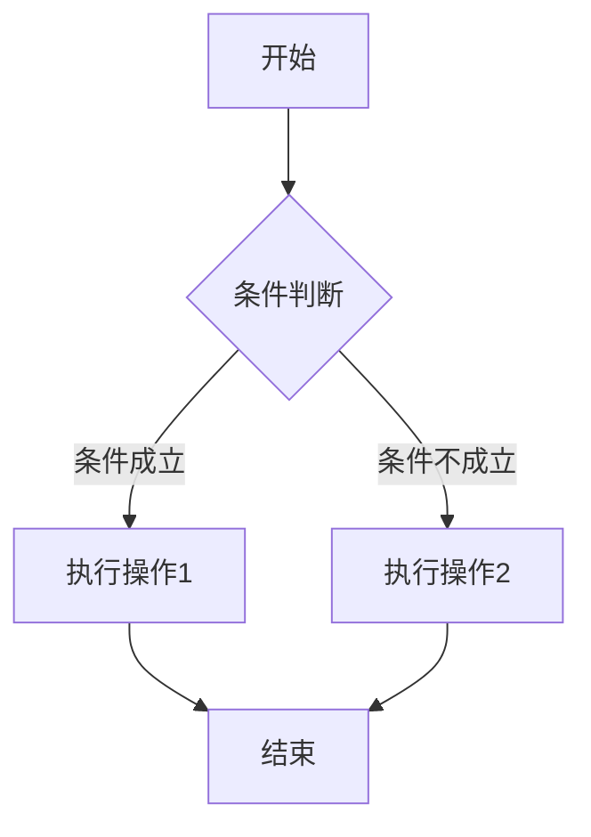
```mermaid
graph TD
    A[开始] --> B{条件判断}
    B -->|条件成立| C[执行操作1]
    B -->|条件不成立| D[执行操作2]
    C --> E[结束]
    D --> E
```

### 2.2 时序图（Sequence Diagram）

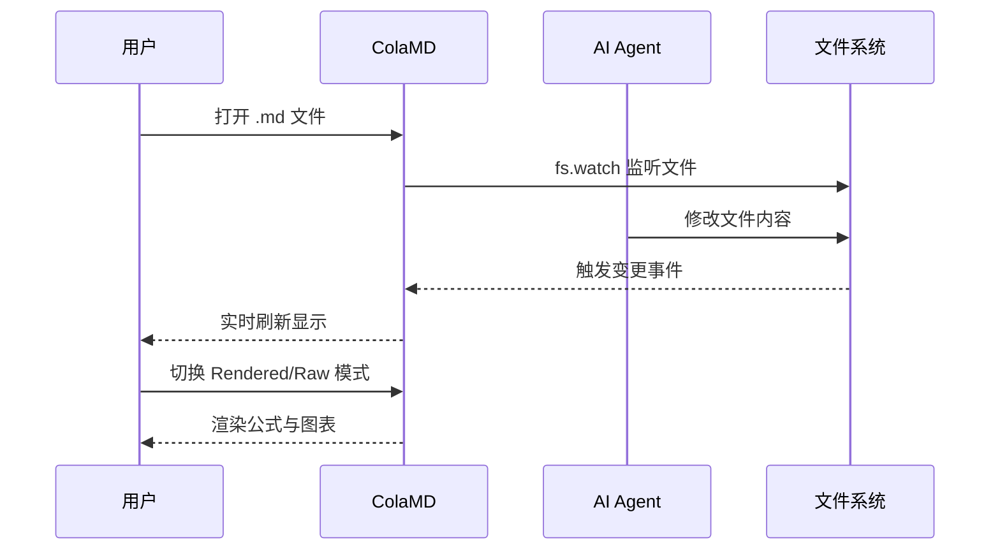
```mermaid
sequenceDiagram
    participant U as 用户
    participant C as ColaMD
    participant A as AI Agent
    participant F as 文件系统

    U->>C: 打开 .md 文件
    C->>F: fs.watch 监听文件
    A->>F: 修改文件内容
    F-->>C: 触发变更事件
    C-->>U: 实时刷新显示
    U->>C: 切换 Rendered/Raw 模式
    C-->>U: 渲染公式与图表
```

### 2.3 类图（Class Diagram）

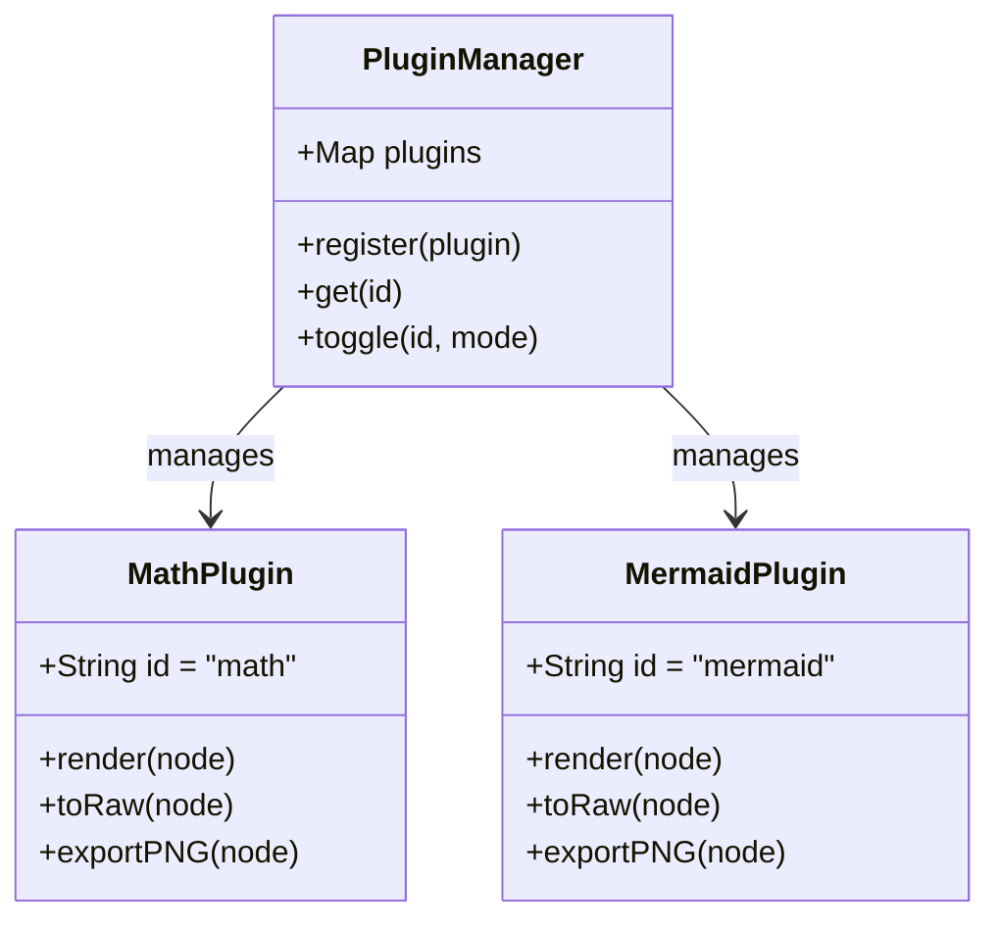
```mermaid
classDiagram
    class PluginManager {
        +Map plugins
        +register(plugin)
        +get(id)
        +toggle(id, mode)
    }

    class MathPlugin {
        +String id = "math"
        +render(node)
        +toRaw(node)
        +exportPNG(node)
    }

    class MermaidPlugin {
        +String id = "mermaid"
        +render(node)
        +toRaw(node)
        +exportPNG(node)
    }

    PluginManager --> MathPlugin : manages
    PluginManager --> MermaidPlugin : manages
```

### 2.4 状态图（State Diagram）

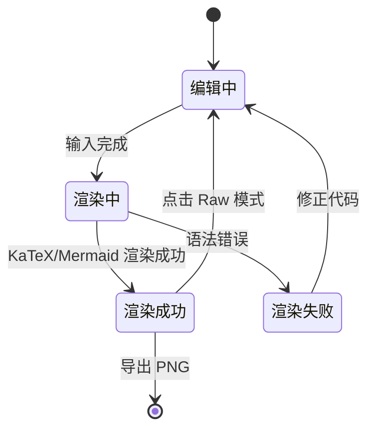
```mermaid
stateDiagram-v2
    [*] --> 编辑中
    编辑中 --> 渲染中 : 输入完成
    渲染中 --> 渲染成功 : KaTeX/Mermaid 渲染成功
    渲染中 --> 渲染失败 : 语法错误
    渲染失败 --> 编辑中 : 修正代码
    渲染成功 --> 编辑中 : 点击 Raw 模式
    渲染成功 --> [*] : 导出 PNG
```

### 2.5 ER 图（Entity Relationship）

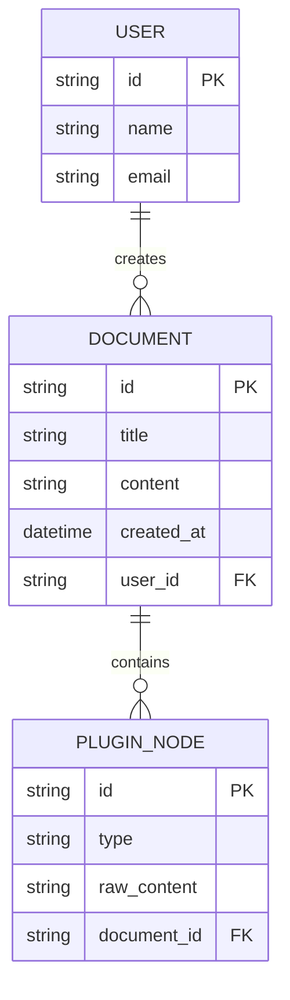
```mermaid
erDiagram
    USER ||--o{ DOCUMENT : creates
    USER {
        string id PK
        string name
        string email
    }
    DOCUMENT {
        string id PK
        string title
        string content
        datetime created_at
        string user_id FK
    }
    DOCUMENT ||--o{ PLUGIN_NODE : contains
    PLUGIN_NODE {
        string id PK
        string type
        string raw_content
        string document_id FK
    }
```

### 2.6 甘特图（Gantt Chart）

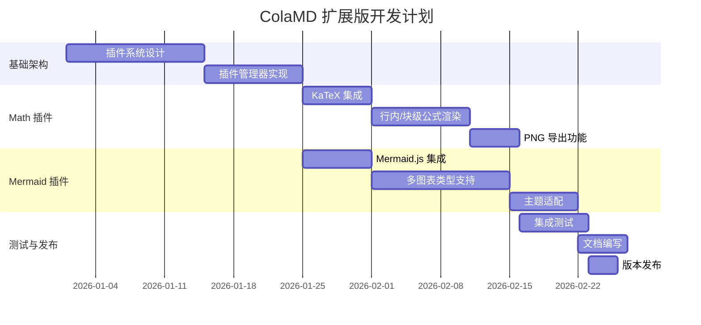
```mermaid
gantt
    title ColaMD 扩展版开发计划
    dateFormat  YYYY-MM-DD

    section 基础架构
    插件系统设计           :a1, 2026-01-01, 14d
    插件管理器实现         :a2, after a1, 10d

    section Math 插件
    KaTeX 集成             :b1, after a2, 7d
    行内/块级公式渲染       :b2, after b1, 10d
    PNG 导出功能           :b3, after b2, 5d

    section Mermaid 插件
    Mermaid.js 集成        :c1, after a2, 7d
    多图表类型支持         :c2, after c1, 14d
    主题适配               :c3, after c2, 7d

    section 测试与发布
    集成测试               :d1, after b3, 7d
    文档编写               :d2, after c3, 5d
    版本发布               :d3, after d1, 3d
```

### 2.7 饼图（Pie Chart）

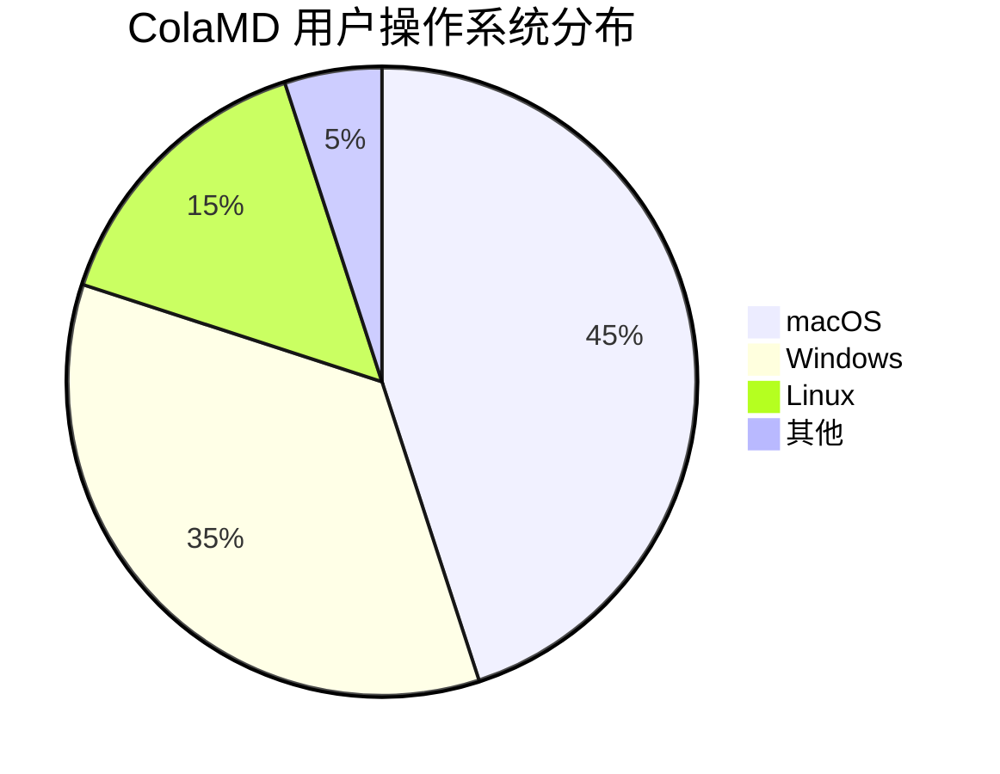
```mermaid
pie title ColaMD 用户操作系统分布
    "macOS" : 45
    "Windows" : 35
    "Linux" : 15
    "其他" : 5
```

### 2.8 用户旅程图（User Journey）

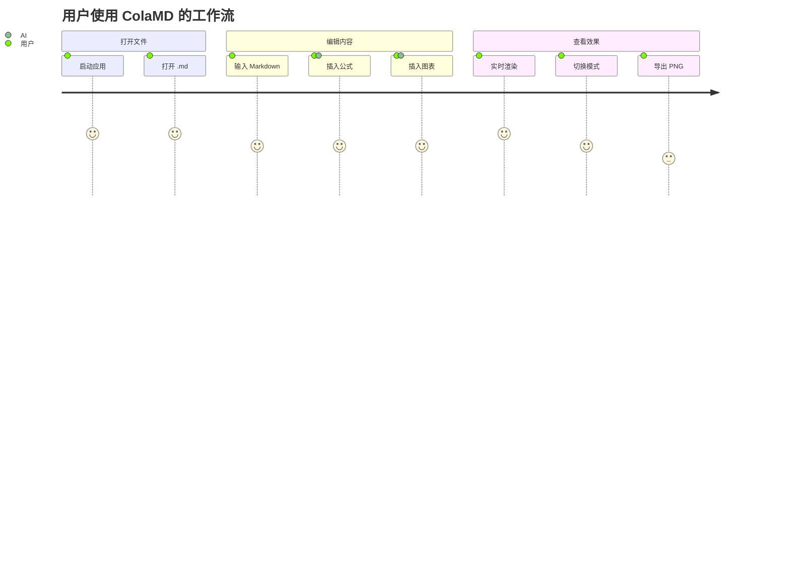
```mermaid
journey
    title 用户使用 ColaMD 的工作流
    section 打开文件
      启动应用: 5: 用户
      打开 .md: 5: 用户
    section 编辑内容
      输入 Markdown: 4: 用户
      插入公式: 4: 用户, AI
      插入图表: 4: 用户, AI
    section 查看效果
      实时渲染: 5: 用户
      切换模式: 4: 用户
      导出 PNG: 3: 用户
```

### 2.9 Git 图（Git Graph）

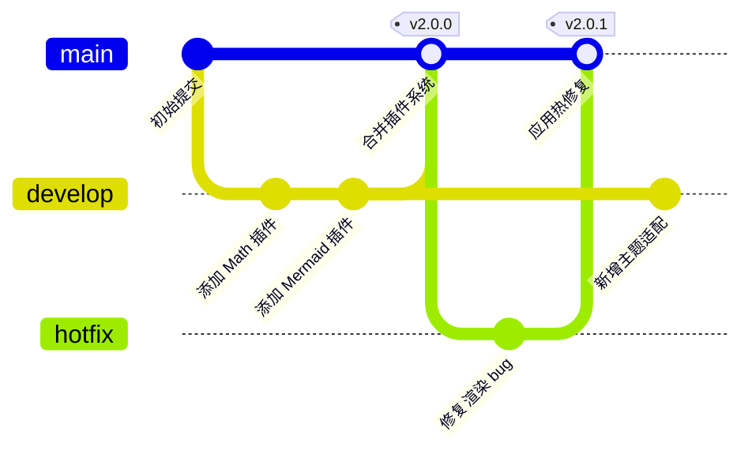
```mermaid
gitGraph
    commit id: "初始提交"
    branch develop
    checkout develop
    commit id: "添加 Math 插件"
    commit id: "添加 Mermaid 插件"
    checkout main
    merge develop id: "合并插件系统" tag: "v2.0.0"
    branch hotfix
    checkout hotfix
    commit id: "修复渲染 bug"
    checkout main
    merge hotfix id: "应用热修复" tag: "v2.0.1"
    checkout develop
    commit id: "新增主题适配"
```

### 2.10 思维导图（Mindmap）

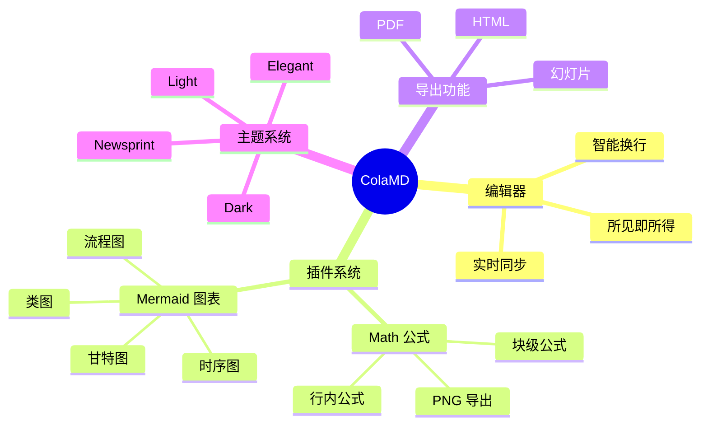
```mermaid
mindmap
  root((ColaMD))
    编辑器
      所见即所得
      实时同步
      智能换行
    插件系统
      Math 公式
        行内公式
        块级公式
        PNG 导出
      Mermaid 图表
        流程图
        时序图
        类图
        甘特图
    导出功能
      PDF
      HTML
      幻灯片
    主题系统
      Light
      Dark
      Elegant
      Newsprint
```

### 2.11 时间线（Timeline）

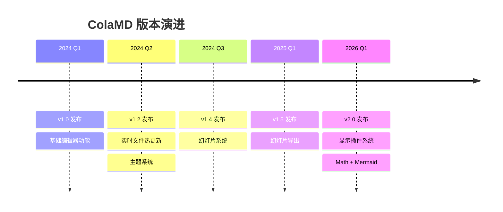
```mermaid
timeline
    title ColaMD 版本演进
    2024 Q1 : v1.0 发布
            : 基础编辑器功能
    2024 Q2 : v1.2 发布
            : 实时文件热更新
            : 主题系统
    2024 Q3 : v1.4 发布
            : 幻灯片系统
    2025 Q1 : v1.5 发布
            : 幻灯片导出
    2026 Q1 : v2.0 发布
            : 显示插件系统
            : Math + Mermaid
```

### 2.12 四象限图（Quadrant Chart）

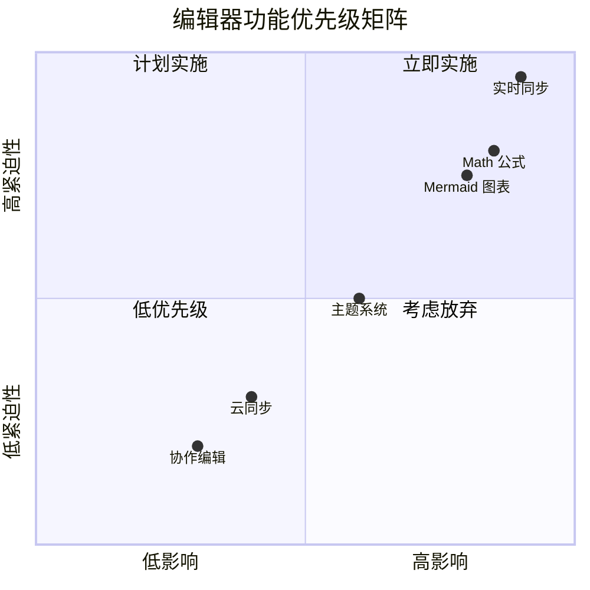
```mermaid
quadrantChart
    title 编辑器功能优先级矩阵
    x-axis 低影响 --> 高影响
    y-axis 低紧迫性 --> 高紧迫性
    quadrant-1 立即实施
    quadrant-2 计划实施
    quadrant-3 低优先级
    quadrant-4 考虑放弃

    "实时同步": [0.9, 0.95]
    "Math 公式": [0.85, 0.8]
    "Mermaid 图表": [0.8, 0.75]
    "主题系统": [0.6, 0.5]
    "云同步": [0.4, 0.3]
    "协作编辑": [0.3, 0.2]
```

### 2.13 XY 图表 / 柱状图（XY Chart）

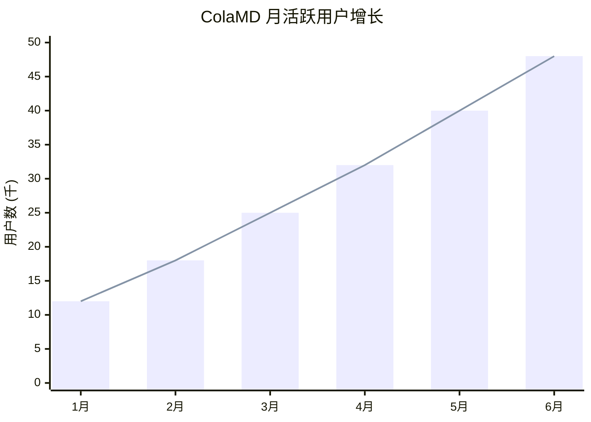
```mermaid
xychart-beta
    title "ColaMD 月活跃用户增长"
    x-axis ["1月", "2月", "3月", "4月", "5月", "6月"]
    y-axis "用户数 (千)" 0 --> 50
    bar [12, 18, 25, 32, 40, 48]
    line [12, 18, 25, 32, 40, 48]
```

### 2.14 C4 架构图（C4Context）

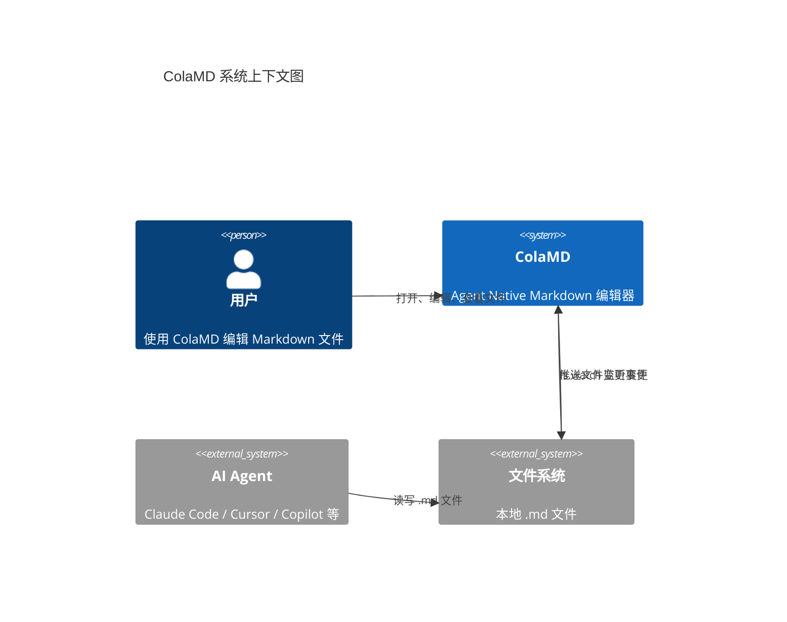
```mermaid
C4Context
    title ColaMD 系统上下文图

    Person(user, "用户", "使用 ColaMD 编辑 Markdown 文件")
    System(colamd, "ColaMD", "Agent Native Markdown 编辑器")
    System_Ext(agent, "AI Agent", "Claude Code / Cursor / Copilot 等")
    System_Ext(filesystem, "文件系统", "本地 .md 文件")

    Rel(user, colamd, "打开、编辑、查看文件")
    Rel(agent, filesystem, "读写 .md 文件")
    Rel(colamd, filesystem, "fs.watch 监听变更")
    Rel(filesystem, colamd, "推送文件变更事件")
```

### 2.15 Sankey 图（Sankey Diagram）

```mermaid
sankey-beta
ColaMD,Math-Plugin,35
ColaMD,Mermaid-Plugin,40
ColaMD,编辑器核心,25
Math-Plugin,行内公式,15
Math-Plugin,块级公式,20
Mermaid-Plugin,流程图,12
Mermaid-Plugin,时序图,10
Mermaid-Plugin,其他图表,18
```

### 2.16 Block 图（Block Diagram）

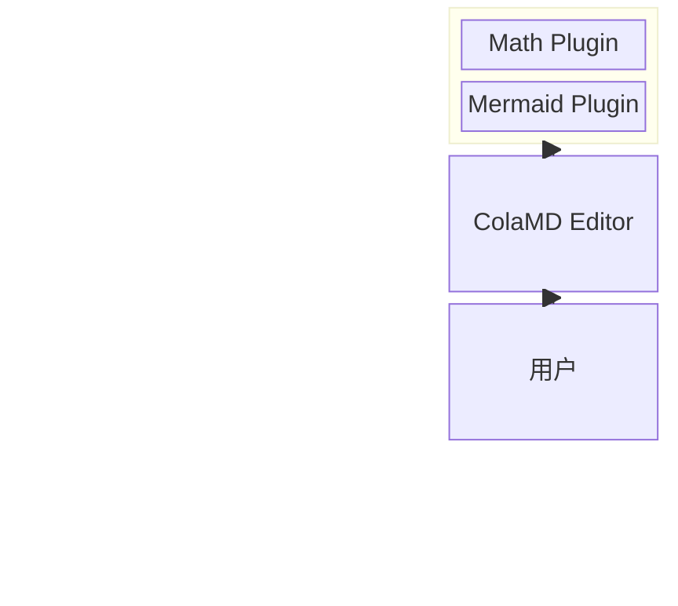
```mermaid
block-beta
    columns 3
    space:2
    block:plugin_group:1
        columns 1
        math["Math Plugin"]
        mermaid["Mermaid Plugin"]
    end
    space:2
    editor["ColaMD Editor"]
    space:2
    user["用户"]
    space:2

    editor --> plugin_group
    user --> editor
```

### 2.17 复杂流程图（带聚群）

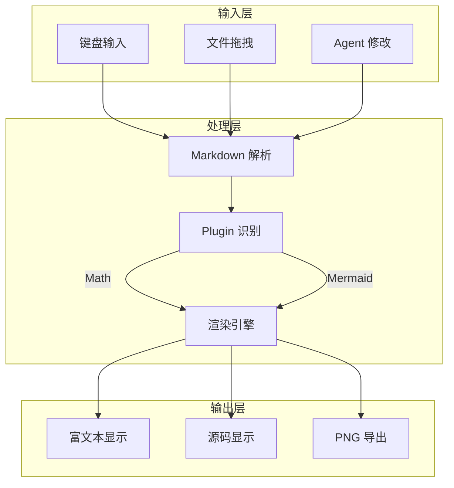
```mermaid
graph TB
    subgraph 输入层
        A1[键盘输入]
        A2[文件拖拽]
        A3[Agent 修改]
    end

    subgraph 处理层
        B1[Markdown 解析]
        B2[Plugin 识别]
        B3[渲染引擎]
    end

    subgraph 输出层
        C1[富文本显示]
        C2[源码显示]
        C3[PNG 导出]
    end

    A1 --> B1
    A2 --> B1
    A3 --> B1
    B1 --> B2
    B2 -->|Math| B3
    B2 -->|Mermaid| B3
    B3 --> C1
    B3 --> C2
    B3 --> C3
```

***

## 三、混合内容演示

以下段落同时包含 **行内公式**、**块级公式** 和 **Mermaid 图表**，展示插件的协同工作能力：

在机器学习领域，线性回归模型的损失函数定义为：

$$
J(\theta) = \frac{1}{2m} \sum_{i=1}^{m} \left( h_\theta(x^{(i)}) - y^{(i)} \right)^2
$$

其中 $h_\theta(x) = \theta^T x$ 是假设函数，$m$ 是样本数量。梯度下降算法的更新规则为：

$$
\theta_j := \theta_j - \alpha \frac{\partial}{\partial \theta_j} J(\theta)
$$

下面是一个机器学习工作流的流程图：

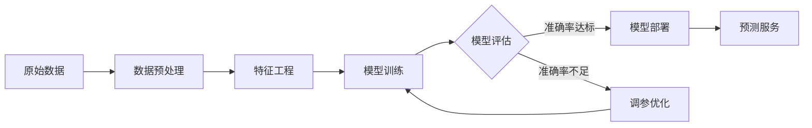
```mermaid
graph LR
    A[原始数据] --> B[数据预处理]
    B --> C[特征工程]
    C --> D[模型训练]
    D --> E{模型评估}
    E -->|准确率达标| F[模型部署]
    E -->|准确率不足| G[调参优化]
    G --> D
    F --> H[预测服务]
```

神经网络的反向传播可以用矩阵形式表示。设第 $l$ 层的误差为 $\delta^{(l)}$，则：

$$
\delta^{(l)} = \left( (W^{(l)})^T \delta^{(l+1)} \right) \odot \sigma'(z^{(l)})
$$

其中 $\odot$ 表示 Hadamard 积，$\sigma'$ 是激活函数的导数。

***

## 四、操作指南

### 切换渲染模式

1. 点击顶部菜单栏 **Plug**
2. 选择 **Math** 或 **Mermaid**
3. 点击 **Rendered** 查看渲染效果，或 **Raw** 查看/编辑源码

### 导出为 PNG

* **Math 公式**：右键点击公式 → **Save Equation as PNG**

* **Mermaid 图表**：右键点击图表 → **Save Diagram as PNG**

### 编辑源码

1. 切换到 **Raw** 模式
2. 在文本框中直接修改 LaTeX 或 Mermaid 代码
3. 点击编辑器其他区域失焦，自动保存并重新渲染

***

> **提示**：本文档中的所有公式和图表均可在 **Rendered** 和 **Raw** 模式之间自由切换，体验 ColaMD 的插件渲染控制能力。
