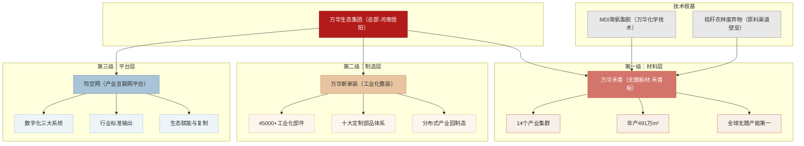
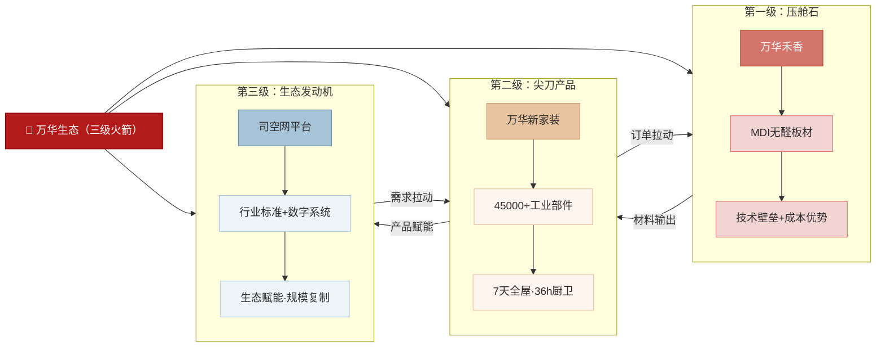
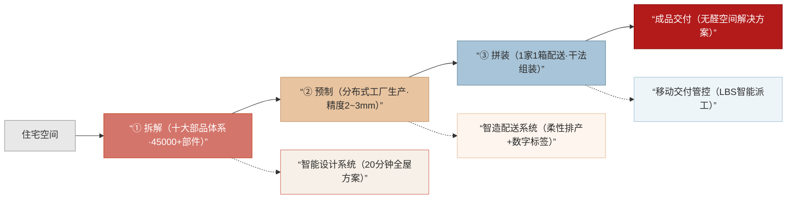
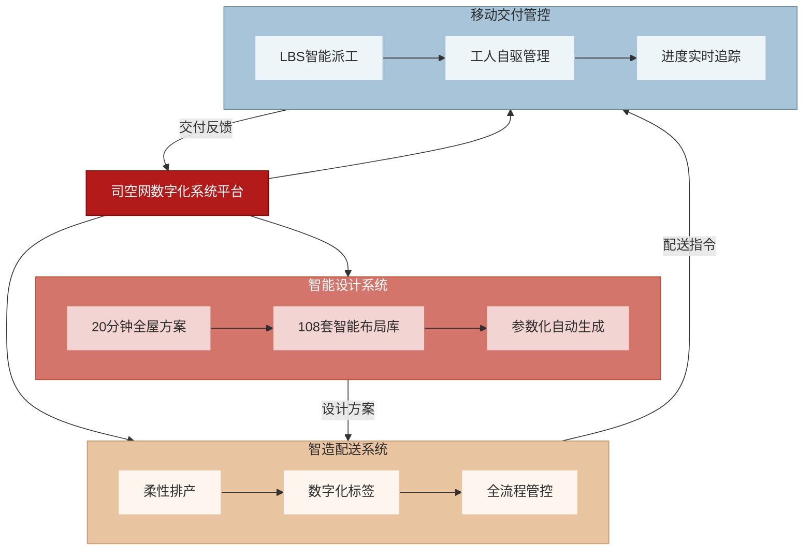
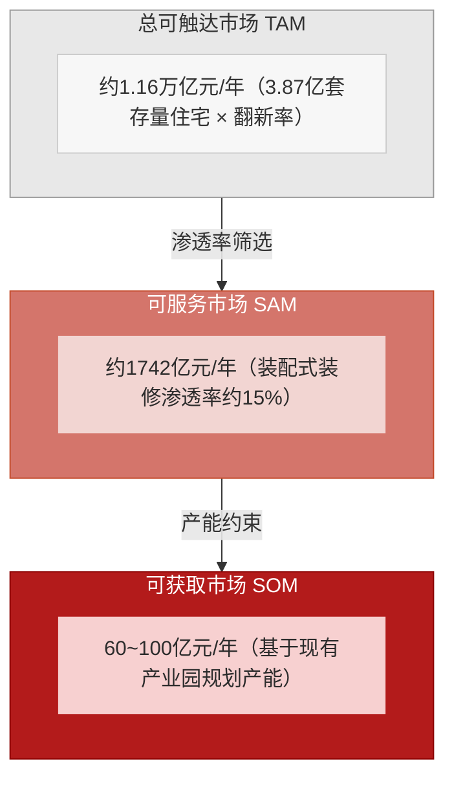
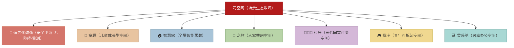
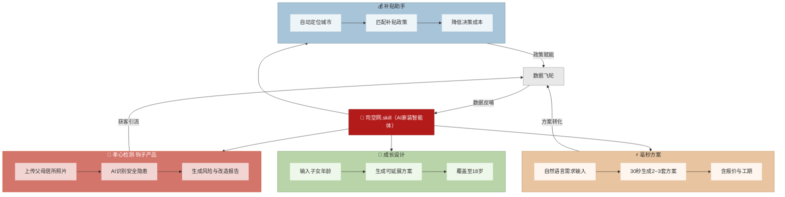

# 万华生态及司空网发展与规划分析：基于产业链纵深与产业互联网赋能的战略研究

**作者视角说明**：以战略投资者视角撰写

**成文日期**：2026年5月12日

***

## 摘要

在存量房时代与消费升级双重驱动下，传统家装行业面临效率、环保与标准化三大结构性痛点。本文以万华生态集团及其旗下产业互联网平台司空网为研究对象，系统剖析其“材料（禾香板）—制造（工业化整装）—平台（司空网）”三级火箭商业模式的底层逻辑。研究发现，该模式通过MDI无醛技术构建上游壁垒，将家装拆解为45 000余个工业化部件实现7天快速交付，并借助AI智能体“司空网.skill”以“孝心检测”为钩子切入适老化改造等细分赛道，精准卡位万亿级存量房翻新市场。本文进一步评估其与欧派、索菲亚等可比公司的竞争格局，识别C端品牌认知薄弱、非上市资本约束等核心风险，并基于产业链纵深与长期主义逻辑提出投资判断。研究认为，万华生态通过工业化、数字化、绿色化三重力量重构家装行业生产关系，具有显著的产业链战略投资价值。

**关键词**：万华生态；司空网；产业互联网；工业化家装；存量房市场；无醛板材；适老化改造；AI赋能；产业链纵深

**中图分类号**：F426.9；F49

**文献标识码**：A

***

## 0 引言

中国家装行业长期存在工期长（30 \~ 90天）、甲醛污染普遍、价格不透明、质量高度依赖工匠经验等结构性痛点。随着2025年中国存量房装修占比首次超越新房，市场对快速、环保、标准化的翻新解决方案需求呈爆发式增长。万华生态集团以独特的全产业链布局，正试图通过工业化与数字化手段重构行业生产关系。本文旨在回答三个核心问题：其商业模式底层逻辑为何？司空平台如何实现规模化赋能？在万亿存量市场中，其长期投资价值何在？

***

## 1 万华生态集团概况

### 1.1 创立背景与技术起源

万华生态成立于2006年，总部位于河南省信阳市。创始人郭兴田先生原任全球MDI龙头企业万华化学副总裁。1999年，一则关于北京业主因装修甲醛污染提起法律诉讼的新闻促使其萌发研发无醛胶粘剂的念头；历经6年技术攻关，于2007年成功推出全球首块秸秆无醛板材——“禾香板”。

### 1.2 发展里程碑与核心认证

其核心技术与发展历程中的重要节点如表1所示。

**表1　万华生态发展里程碑**

| 年份   | 事件                                 |
| ---- | ---------------------------------- |
| 2007 | 全球首块秸秆无醛板材“禾香板”问世                  |
| 2009 | “禾香板”技术荣获**国家科技进步二等奖**             |
| 2018 | 获习近平总书记视察肯定，称其为“利国利民的好产品”          |
| 当前   | 产能达491万立方米/年，全国14个产业集群，全球无醛人造板产能第一 |

### 1.3 核心产品与技术壁垒

“禾香板”以稻麦秸秆、芦苇、棉杆等农林废弃物为原料，采用万华化学自主研发的MDI聚氨酯胶替代传统脲醛胶，实现零甲醛添加。该技术不仅解决了室内装修环保痛点，更形成了难以复制的原料渠道壁垒与配方技术壁垒。

**图1　万华生态集团组织架构与业务层级**

***

## 2 商业模式解构

### 2.1 “三级火箭”模型

万华生态的商业模式可概括为三级火箭结构：

1. **第一级（压舱石）**：万华禾香（无醛板材）——提供上游材料技术壁垒与成本优势。
2. **第二级（尖刀产品）**：万华新家装（工业化整装）——将板材加工为标准部品部件，形成整装解决方案。
3. **第三级（生态发动机）**：司空网（产业互联网平台）——输出行业标准、数字化系统与生态赋能，实现规模化复制。

该模式与小米”硬件+新零售+互联网”铁人三项逻辑高度同构，核心在于通过产业链纵深控制，避免在单一环节受制于人。

**图2　万华生态”三级火箭”商业模式**

### 2.2 与传统家装模式的对比

各主要竞争维度的对比如表2所示。

**表2　万华生态与传统家装及可比公司模式对比**

| 维度    | 万华生态          | 传统家装      | 欧派/索菲亚    | 兔宝宝     |
| ----- | ------------- | --------- | --------- | ------- |
| 产业链覆盖 | 材料—制造—平台全三层   | 施工服务      | 柜体定制      | 板材供应    |
| 核心产品  | 无醛空间解决方案      | 现场施工      | 定制柜体      | 人造板     |
| 典型工期  | 7天全屋/36小时厨卫   | 30 \~ 90天 | 30 \~ 45天 | 不适用     |
| 环保性能  | 零甲醛，即装即住      | 普遍甲醛超标    | 依赖板材品质    | 有醛/无醛并存 |
| 标准化程度 | 45 000余个工业化部件 | 高度依赖工匠    | 半标准化      | 原材料标准化  |

关键结论：欧派、索菲亚是万华板材的大客户，但自身尚未建立同等规模的工业化整装制造能力；兔宝宝拥有板材业务但缺乏下游整装壁垒。万华通过全链条打通，实现了从“卖材料”到“卖空间解决方案”再到“赋能行业”的升维竞争。

***

## 3 司空网平台深度解析

### 3.1 平台定位与核心价值

司空网（2015年成立）定位为产业互联网赋能平台，自身不从事终端家装施工，而是为定制家居企业向整装转型提供全套工业化家装解决方案与数字化系统。其行业角色类似移动互联网领域的安卓系统。

### 3.2 核心运作机制

司空网的运作遵循“拆解—预制—拼装”三步骤：

1. **拆解**：将住宅空间拆解为十大定制部品体系（墙体、吊顶、地面、整体卫浴、集成厨房、供水、供电、收纳、门窗、智能），共计45 000余个工业化部件。
2. **预制**：所有部件在分布式产业园内工厂化生产，实现毫米级精度（误差2 \~ 3 mm）。
3. **拼装**：通过”1家1箱、封箱配送”模式运送至现场，由安装工按干法施工流程快速组装。

**图3　司空网”拆解—预制—拼装”运作机制**

### 3.3 数字化三大系统

司空网搭建了三大核心数字化系统以支撑上述运作：

* **智能设计系统**：20分钟输出全屋方案，内置108套智能布局库。

* **智造配送系统**：柔性排产，数字化标签实现全流程管控。

* **移动交付管控系统**：基于LBS的智能派工与工人自驱管理。

**图4　司空网数字化三大系统架构**

### 3.4 人才转型机制

将传统家具设计师或安装工转型为家装设计师或安装工，系统培训周期仅需7天。其核心在于将复杂家装简化为“部件安装”，极大降低了对个人经验与手艺的依赖。

***

## 4 市场机遇分析

### 4.1 存量房翻新市场规模

基于国家统计局与行业研究报告数据，中国存量房翻新市场的规模测算如表3所示。

**表3　存量房翻新市场规模测算**

| 指标             | 数值               |
| -------------- | ---------------- |
| 中国城镇存量住宅套数     | 约3.87亿套          |
| 楼龄超15年老旧小区占比   | 约60%             |
| 2025年存量房装修占比变化 | 首次超过新房，新房需求跌破40% |
| 存量房翻新年化市场规模    | 约1.16万亿元         |

### 4.2 万华模式的匹配性

万华“7天全屋、36小时厨卫、无醛即住、毫米精度”的工业化方案，完美契合存量房翻新对快速、环保、不搬家、标准化的核心诉求。

### 4.3 TAM/SAM/SOM分析

总可触达市场、可服务市场与可获取市场的层级划分如表4所示。

**表4　市场规模层级分析**

| 层级  | 定义        | 年化规模        | 备注             |
| --- | --------- | ----------- | -------------- |
| TAM | 总可触达市场    | 约1.16万亿元    | 基于3.87亿套存量住宅测算 |
| SAM | 装配式可切入市场  | 约1 742亿元    | 假设渗透率15%       |
| SOM | 司空满产可触达市场 | 60 \~ 100亿元 | 基于现有产业园区规划产能   |

当前司空处于从0到1的起步阶段，渗透率提升空间巨大。

**图5　万华生态 TAM/SAM/SOM 市场层级**

***

## 5 细分赛道战略分析

### 5.1 适老化改造市场机遇

中国60岁以上人口已超3.1亿（2024年），预计十年后超过4亿，其中90%的老年人选择居家养老。各地政府出台适老化改造补贴政策，补贴比例最高达30%，每户补贴金额约1 500 \~ 15 000元。当前市场高度分散，缺乏全国性头部品牌，存在显著的先发机会。

### 5.2 “安家7件套”标准化方案

司空推出七大模块化适老产品包，具体包括：

* 安全卫浴（防滑地面+扶手+坐式淋浴）

* 无障碍地面（零高差门槛）

* 智能照明（人体感应+语音控制）

* 厨房改造（升降操作台+下拉吊柜）

* 安全监测（跌倒检测+紧急呼叫）

* 卧室改造（电动护理床+起身扶手）

* 全屋通行（门宽改造+走廊扶手）

产品定价为每模块3 000 \~ 15 000元，政府补贴后用户实际自付约2.1 \~ 5.6万元。

### 5.3 三年增长目标

适老化改造业务的阶段性目标如表5所示。

**表5　适老化改造业务3年增长规划**

| 年份  | 覆盖城市数 | 服务户数   | 年营收目标  |
| --- | ----- | ------ | ------ |
| 第1年 | 5     | 5 000  | 1.25亿元 |
| 第2年 | 15    | 20 000 | 5.6亿元  |
| 第3年 | 30    | 80 000 | 24亿元   |

### 5.4 其他细分赛道

除适老化改造外，司空还规划了六个细分生活场景赛道：童趣（儿童成长型空间）、智慧家（全屋智能预装）、宠屿（人宠共居空间）、和居（三代同堂可变空间）、我宅（青年可拆卸空间）、灵感舱（居家办公空间），共同构成完整的场景生态矩阵。

**图6　司空网七大细分赛道场景生态矩阵**

***

## 6 AI战略布局

### 6.1 “司空网.skill”智能体核心功能

司空网正在开发AI家装智能体“司空网.skill”，其核心功能模块包括：

* **孝心检测**：用户上传父母居所照片，AI自动识别地面高差、缺乏扶手等安全隐患，生成风险与改造报告。该功能作为高传播性钩子产品，旨在通过短视频与社交平台实现低成本获客。

* **毫秒方案**：用户通过自然语言描述需求（如“给腰不好的母亲做8 000元预算的卫生间适老改造”），系统30秒内生成长包含报价与工期的2 \~ 3套方案。

* **补贴助手**：自动匹配用户所在地的适老化改造补贴政策，降低决策成本。

* **成长设计**：根据子女当前年龄生成可延展至18岁的成长型空间方案。

**图7　"司空网.skill" AI智能体功能架构与数据飞轮**

### 6.2 商业化目标

C端12个月内商业化目标为：孝心检测功能使用量达100万次，下单转化率5%，实现C端GMV 1.8亿元。该策略旨在构建“工具获客—数据积累—方案推荐—交易转化”的数据飞轮。

***

## 7 竞争格局分析

### 7.1 核心竞争维度对比

万华生态与主要竞争对手在关键维度的对比评级如表6所示。

**表6　竞争格局多维度对比**

| 维度      | 万华生态  | 兔宝宝  | 欧派    | 索菲亚   |
| ------- | ----- | ---- | ----- | ----- |
| 产业链覆盖   | ★★★★★ | ★★   | ★★★   | ★★    |
| 无醛技术壁垒  | ★★★★★ | ★★★  | ★★★   | ★★    |
| 工业化整装能力 | ★★★★★ | ★★   | ★★★   | ★★★   |
| 存量房布局深度 | ★★★★★ | ★★   | ★★★   | ★★★   |
| C端品牌认知度 | ★★★   | ★★★★ | ★★★★★ | ★★★★★ |

 

### 7.2 关键竞争洞察

欧派、索菲亚是万华板材（禾香板）的大客户，但其自身尚未建立同等规模的工业化整装制造能力——这正是万华的核心壁垒所在。万华旨在成为大家居行业的“安卓+高通”，即提供底层技术标准与平台赋能，而非直接与B端客户在终端市场竞争。

***

## 8 风险与挑战

### 8.1 C端品牌认知薄弱

在消费者端，“司空”品牌声量远低于欧派、索菲亚等定制家居巨头，需持续投入品牌建设以推动C端转化。

### 8.2 资本约束与融资压力

万华生态目前为非上市企业，重资产模式（14个产业基地）对资金需求较大，融资渠道相对受限。IPO已于2024年8月启动辅导，但上市进程存在不确定性。

### 8.3 产能利用率爬坡

各产业园区需达到经济产能利用率。以平舆基地为例，当前日产约20户，目标日产100户，订单获取与产能消化之间需持续平衡。

### 8.4 大客户关系平衡

万华既向欧派、索菲亚等大客户供应板材，又通过司空平台赋能其他定制企业转型整装，存在潜在的利益博弈与客户关系管理挑战。

### 8.5 标准化与个性化的张力

45 000余个标准化部件如何在效率与体验之间取得平衡，能否满足Z世代对个性化与设计感的极致追求，是产品迭代需要持续解决的课题。

***

## 9 结论与投资建议

### 9.1 核心研究结论

本研究认为，万华生态及司空网具备显著的长期投资价值，主要基于以下五点逻辑：

1. **赛道确定性高**：精准卡位万亿级存量房翻新市场，趋势不可逆。
2. **技术护城河深厚**：MDI无醛技术、秸秆原料替代与全产业链布局构成多重壁垒。
3. **商业模式先进**：产业链纵深与平台赋能逻辑清晰，符合产业升级方向。
4. **窗口期优势**：拥有2 \~ 3年先发优势，且受益于“以旧换新”等政策红利。
5. **AI赋能想象空间大**：“司空网.skill”以孝心检测为钩子的策略，有望实现低成本获客与数据飞轮构建。

### 9.2 估值参考区间

基于公开信息与企业规划的推演估值如表7所示。

**表7　估值推演**

| 时间维度   | 材料业务   | 整装业务   | 合计营收   | 隐含估值（按PS 1 \~ 2x） |
| ------ | ------ | ------ | ------ | ----------------- |
| 当前基准   | 约100亿元 | 约2亿元   | 约102亿元 | 约102 \~ 204亿元     |
| 中期（3年） | 约130亿元 | 约45亿元  | 约175亿元 | 约175 \~ 350亿元     |
| 远期（5年） | 约200亿元 | 约140亿元 | 约340亿元 | 约340 \~ 680亿元     |

### 9.3 投资建议

若万华生态启动IPO或司空网独立融资，建议将其作为产业链战略价值高、短期财务可见性相对较低的长期主义投资标的进行重点关注。其价值不仅体现在当期利润，更在于对传统家装行业生产关系进行系统性重构的产业潜力。

***

## 参考文献

[1] 万华生态集团. 企业简介与公开资料[EB/OL]. (2025-01-01) [2026-05-12]. <https://www.whst.com>.

[2] 司空科技. 司空网官方平台介绍[EB/OL]. (2025-06-01) [2026-05-12]. <https://www.skong.com>.

[3] 新华网. 习近平总书记考察万华生态集团并肯定“禾香板”产品[EB/OL]. (2018-11-12) [2026-05-12]. <https://www.xinhuanet.com>.

\[4] 国家科学技术奖励工作办公室. 2009年度国家科学技术进步奖获奖项目公告\[R]. 北京: 国家科学技术奖励工作办公室, 2009.

\[5] 国家统计局. 中国统计年鉴2025\[M]. 北京: 中国统计出版社, 2025.

\[6] 艾瑞咨询. 中国存量房装修市场及适老化改造行业研究报告\[R]. 上海: 艾瑞咨询集团, 2025.

\[7] 万华生态集团. 万华生态集团2024年度企业社会责任报告\[R]. 信阳: 万华生态集团, 2025.

\[8] 司空科技. “司空网.skill”AI家装智能体产品白皮书\[R]. 北京: 司空科技, 2026.

\[9] 中国国家标准化管理委员会. 科学技术报告、学位论文和学术论文的编写格式: GB/T 7713—201X\[S]. 北京: 中国标准出版社, 201X.

***

*声明：本文基于公开信息整理与推演，文中财务数据与估值区间为基于公开资料的测算估算，不构成任何正式投资建议。实际数据以企业正式披露为准。*
